(CODE COMING SOON)

# A Qualitative Study of Sparse Autoencoder Features within Othello-GPT

Recently, training sparse autoencoders (SAEs) to extract interpretable features from language models has gained significant attention in the field of mechanistic interpretability. Training SAEs on model activations aims to address the problem of superposition, where multiple features learned by the model overlap within a single dimension of the internal representation. This phenomenon, known as polysemanticity, complicates the interpretation of model activations. By training SAEs to decompose activations into a sparser representation, insights into model representations can be more easily obtained. However, both training SAEs and interpreting the sparsified model activations remain challenging, as it is unclear a priori which features the model is learning [[1]](#1).

To partially address this, SAEs can be studied in toy models. One popular toy model in the field of mechanistic interpretability is Othello-GPT [[3](#3), [4](#4), [5](#5)]. The transformer decoder-based architecture, similar to that of current large language models, aims to predict the next legal move in an Othello board game when given a sequence of moves. Previous research has shown that, even though the model has no knowledge whatsoever of the rules of the game, a linear probe can be trained on the residual stream activations to reliably predict the current board state [[4]](#4). This means that internally, the model encodes the state of the board linearly simply from its objective to predict the next move. With this, it has been demonstrated that board states can be features present in Othello-GPT, making it a suitable toy model to study the usability of SAEs as a priori there is some knowledge of what features might be present in the model [[2]](#2).

Previous studies have already explored the application of SAEs in the context of Othello-GPT. For instance, He et al. (2024) [[1]](#1) investigated circuit discovery in Othello-GPT, utilizing SAE features to discover a circuit the model uses to understand a local part of the board state around a tile. They also examined features identified by the sparse autoencoders. A research report by Huben (2024) [[2]](#2) focused more specifically on extracting board state features from the SAE model, using the activations of the SAEs as classifiers for board state, assessing the usefulness of SAEs as a technique to discover board state features. Even more recently, Karvonen et al. (2024) [[7]](#7) trained a large number of SAEs on Othello and Chess models, using board reconstruction and the coverage of specified candidate features as proxies to assess the quality of the trained SAEs. 

Although these works focus on a central problem for SAE training—how to assess the quality of the trained SAEs—they do not extensively visualize the various features within the sparse autoencoders or provide methods or code to obtain these visualizations. In this work, I discover a set of features and provide a detailed description of the methods used to obtain them, along with the visualizations used to assess the purpose of these features. 

Next, I will provide a brief introduction to the Othello game. Then, I will outline my experimental setup, detailing the training process for both Othello-GPT and the SAEs. Following this, I will describe how I obtained and visualized the board state features of the SAEs, and I will conduct both a quantitative and qualitative analysis of these features. Finally, I will conclude with a discussion of my findings.

## Othello
TODO: explain othello game. Here also dive a little bit in the 'mine' and 'their' representation: Because the same model predicts both moves for white and for black, it learns to represent the board as 'my pieces' when its the corresponding turn for that color, which whould be even moves for black as black always starts in othello, and all white pieces are then the 'their' pieces. When the move is played and the next move will be predicted, suddenly the board state can be better predicted when the 'mine' features are used on the white pieces now, as it is now whits turn to play. 

# Experimental Setup

Before I can visualize features, I need access to an Othello-GPT model with its respective SAEs. Currently, the only open-source Othello-GPT model with SAEs has a residual stream dimensionality of 512 and consists of 8 layers. However, it is known that much smaller Othello-GPT models, even those with only 1 layer, can achieve almost perfect accuracy [[3]](#3). Since I want to inspect the features of SAEs myself, a smaller model size than the currently open-source model is preferred. Therefore, I decided to train the Othello-GPT and SAEs from scratch. For this purpose, I used the [TransformerLens](https://github.com/TransformerLensOrg/TransformerLens) library to train the Othello-GPT and [SAELens](https://github.com/jbloomAus/SAELens) for the SAEs. SAELens provides a full training pipeline compatible with models from the TransformerLens library. One problem I encountered was that SAELens does not currently support using locally trained models from TransformerLens directly and is only compatible with official TransformerLens models available on HuggingFace. To enable the use of custom models, I made several modifications to the respective libraries. These changes are detailed in this [file](https://github.com/thijmennijdam/Othello-GPT-FeatInterp/blob/main/changes.md).

The dataset used for this research is publicly [available](https://huggingface.co/datasets/taufeeque/othellogpt) on HuggingFace and consists of 23.5 million synthetic Othello games.
## Model Training

### Othello-GPT

To find a good balance between a realistic architecture and research efficiency, I used a residual stream dimension of 128 and 6 layers, similar to the configuration used by He et al. (2024) [[1]](#1). I trained the model on 1 million games (59 million tokens/moves) for 4 epochs, achieving an accuracy of 96.5%. Full hyperparameters for the model and training can be found in the [Appendix](#hyperparameters-of-othello-gpt).

### Sparse Autoencoders

I trained Sparse Autoencoders (SAEs) in layers 1, 3, and 5 to observe effects at early, middle, and later stages within the model. Similar to work of Huben (2024) [[2]](#2), I chose to train the SAEs on the residual stream. I applied an L1 sparsity penalty of 5, a relatively high value chosen based on initial satisfactory results and time constraints that did not allow for further optimization.

Two variants of SAEs were trained for each of these layers, with expansion factors of 8 and 32. This means the hidden dimension of the sparse autoencoder is 8 or 32 times larger than the input size (the residual stream). The SAEs were trained on 80,000 games, amounting to approximately 4 million tokens or moves. From now on, I will refer to the SAEs by combining the layer number and expansion factor, such as L3E32 for the SAE trained on the third layer with an expansion factor of 32.

Figure 1a shows that SAEs with an expansion factor of 8 have no dead features (features that activate at least once in 1,000 model forward passes), while the E32 variants exhibit dead features. This outcome is not surprising due to the significantly greater number of features available, providing the SAEs with more capacity to learn. As the dimensionality of the E32 variants is 4,096, this means that L1 and L3 have about 5% dead features, while in L5, this increases to approximately 22%.

Although the later layers have more dead features, they also have higher explained variance (Figure 1b) and higher reconstruction loss (Figure 1c). This means that while fewer features are needed to explain a larger portion of the data's variance in the later layers, there is relatively more predictive power in the unexplained variance, as the SAEs perform worse at reconstructing the input.

<table>
  <tr>
    <td style="padding: 10px;">
      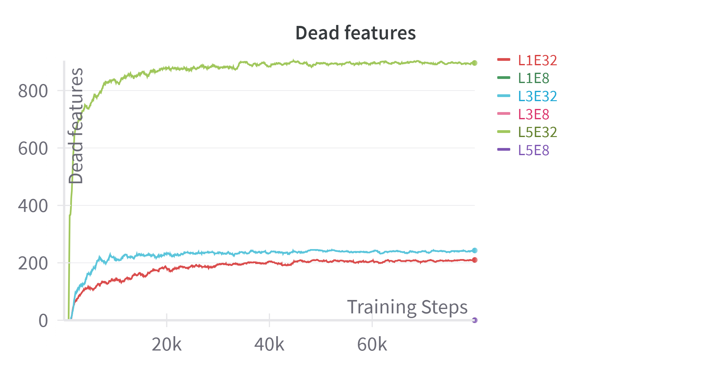
    </td>
    <td style="padding: 10px;">
      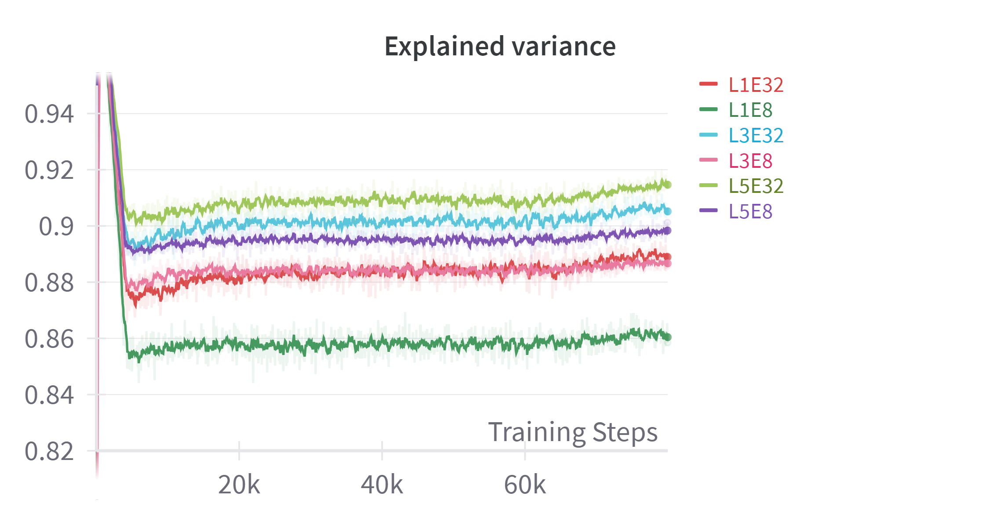
    </td>
    <td style="padding: 10px;">
      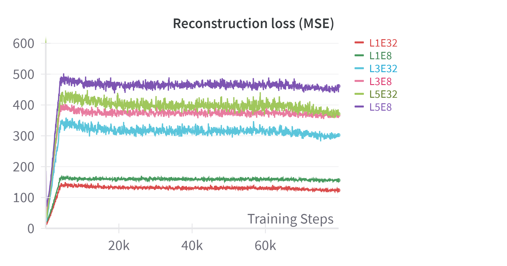
    </td>
  </tr>
</table>

Figure 1. From left to right: (a) Number of dead features (b) Explained variance (c) Reconstruction error (MSE) across training.

# How to Find Board State Features Using Sparse Autoencoders

Now that we have trained SAEs on our Othello-GPT model, we employ a common practice in dictionary learning to associate behaviors with autoencoder features. This method, known as [Max Activating Dataset Examples](https://dynalist.io/d/n2ZWtnoYHrU1s4vnFSAQ519J#z=pwjeUj-94p6EwwMO_41Kb3h1), involves running a large amount of data through the model to identify the inputs that most activate a particular neuron. By examining these inputs, we can potentially observe patterns, providing evidence that the feature is detecting these patterns. We apply this technique across all features in our six SAEs. The full pipeline is as follows:

1. First, I run the 30,00 games, each with 60 moves, through the model and SAEs. The number of games was chosen to allow local storage of these activations. This process yields `n_games x seq_dim x d_sae` activations, where `seq_dim=60`, representing the number of moves in Othello games. For each SAE feature, this results in `60 x 30,000 = 1.8M` total activations. Each activation reflects how active this feature is when the associated move is played.

2. Next, I identify the top 1% quantile of all these activations for a specific feature, and then extract these moves.

3. The ground truth board states are computed at these moves using a script that can play Othello games when given move sequences, representing the board as a two-dimensional 8x8 array. In this array, 2 denotes white pieces, 1 denotes black pieces, and 0 indicates blank spaces.

4. The board configurations are translated into "mine" pieces, "theirs" pieces, and "blank" spaces. For instance, if it's white's move, all white pieces on the board are considered "mine" pieces, and the black pieces are "theirs."

5. These boards are separated into three distinct 8x8 arrays: a 'mine board' marked by 1s for the mine pieces and 0s otherwise, a 'their board' showing 1s for the opposing pieces and 0s otherwise, and a 'blank board' for empty spaces.

6. By averaging over all these board states for the three different types, plots like those in Figure 2 can be obtained.

In Figure 2, the tile H0 has a value of 1, indicating its presence in all of the top 1% quantile boards for this feature’s activations.

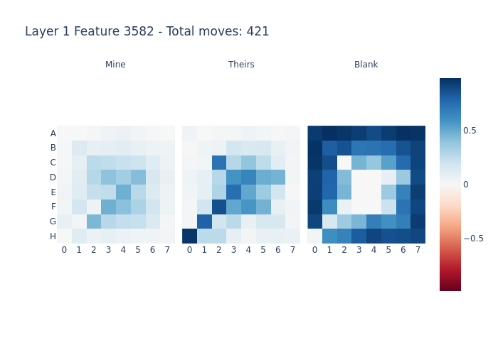

Figure 2: Plot of the average board state of feature 3582 in layer 1. The average was taken over 421 board states. 

In the single board states of the highest three activations, shown in Figure 3, we observe that all these boards have the H0 tile occupied by black pieces (indicated as red tiles, while white pieces are green), and in all instances, it is white's turn to move. The red circle around a tile indicates the last move played, while the purple circles show pieces that were flipped during this move. Notably, in all of these cases, the last move played is also the H0 tile, which suggests that this feature may detect if the move H0 is played by the opponent.

<table>
  <tr>
    <td></td>
    <td>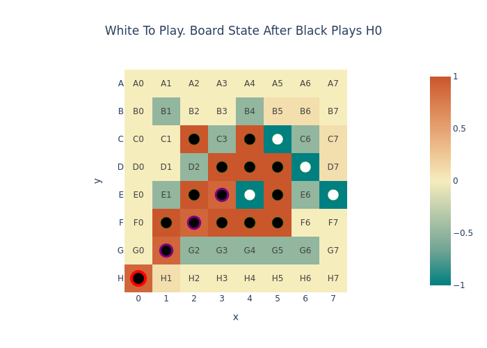</td>
    <td>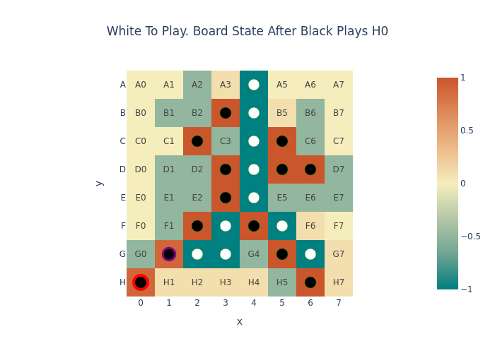</td>
  </tr>
</table>

Figure 3: Top 3 board states that had the highest activations for feature 3582 in L1E32.

Since it is not always guaranteed that a tile will consistently score high when averaging over the top 1% quantile games, I developed a metric to filter out specific average board states for further analysis. This metric is straightforward: it considers the percentage that a tile appears in these board states. If a tile in the 'mine' or 'their' category appears active in at least 95% of the board states (i.e., an average score of 0.95), it is considered relevant for further analysis. This threshold of 0.95 proved effective in identifying high-quality features while allowing a margin for 5% of the games where the tile might not be active. Initially, I set a threshold of 0.99, but it was too restrictive, yielding almost no features for the SAEs in layer 5. In my preliminary results with this metric, I initially encountered many low-quality results due to most features that responded to my metrics only having a handful of games in the top 1% quantile. Therefore, I focused on instances where at least 10 activations were active as an additional condition for further inspection.

# Results

In this section, I present both quantitative and qualitative results of the features identified using the previously defined threshold metric. This metric filters out games that, on average, have at least one tile consistently occupied in 95% of the board states within the top 1% quantile of board activations for an SAE feature. The quantitative results provide initial insights and a high-level understanding of the board state features obtained. In the qualitative results, I dive deeper into which layers identify specific types of board state features and explore patterns of features between and within layers. The average board states, along with the top-k boards for all six SAEs that I have found using this metric, can be found [here](https://github.com/thijmennijdam/Othello-GPT-FeatInterp/tree/main/feature-visualizations/all-features).

## Quantitative results

Figure 4a illustrates that later layers tend to identify fewer board tile features. Although the higher number of dead features observed earlier in Layer 5 might contribute slightly to this trend, it does not fully explain the phenomenon. The difference in the number of dead features between Layer 1 and Layer 3 was not significant, yet Layer 3 shows a considerably lower number of active features compared to Layer 1.

It can be observed in Figure 4b that the average number of board tiles per active feature typically decreases slightly as we go deeper into the model for the E32 SAE variants, but not for the E8 variants. While these trends are not substantial, it is interesting to note that the average number of mine/their tiles (for example, two 'mine' tiles and one 'their' tile would count as three mine/their tiles) ranges between 2 and 2.5. However, qualitatively, I observed that most features have one or two tiles, with outliers that have four or more and resemble higher-level features activated by specific board configurations. This leads to many tiles being above the threshold while most activations are zero. (I should update Figure 3b to a histogram plot to highlight this effect)

Figure 4c reveals that the average game length of the features obtained is quite short, ranging only between 12 and 18 sequences. There is a clear trend for the E32 variants, where the board tiles identified on average are from moves later in the game, suggesting that later layers might be more involved in representing features that appear later in the game.

<table>
  <tr>
    <td style="padding: 10px;">
      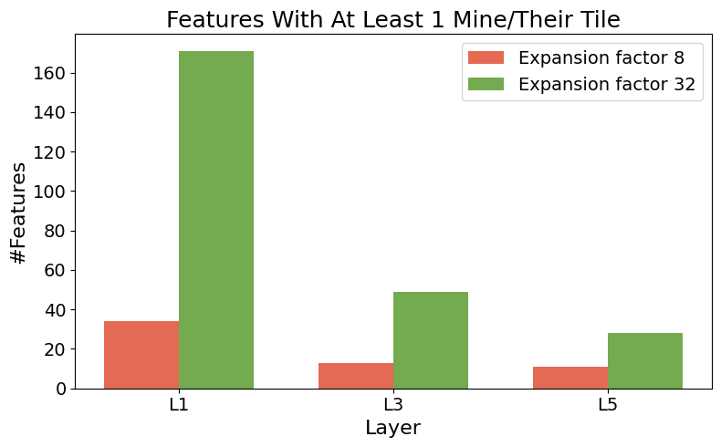
    </td>
    <td style="padding: 10px;">
      
    </td>
    <td style="padding: 10px;">
      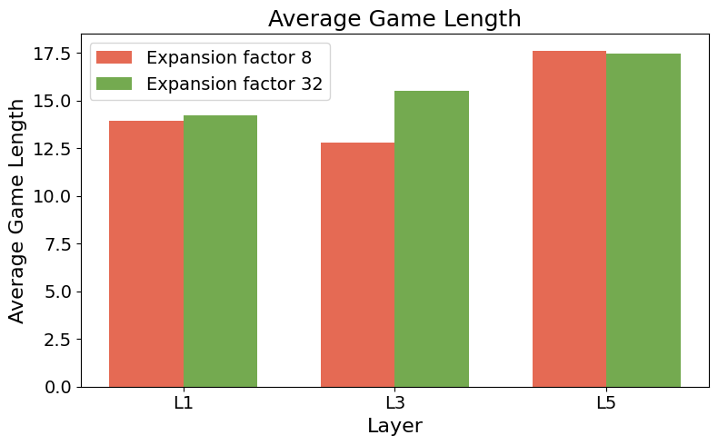
    </td>
  </tr>
</table>

Figure 4. From left to right: (a) Features with at least one active 'Mine' or 'Theirs' tile across different layers, (b) Average number of 'Mine' or 'Theirs' tiles per feature, (c) Average game length of the features identified.

## Qualitative results

What do these average board state plots look like across layers? How do they differ across layers and expansion factors? I examined all the features of the SAEs that met my metric criteria. I focused on identifying any qualitative differences between the E8 and E32 variants to see if, apart from identifying more board state features, there would be a difference in what they detected. I also looked for potential differences in features found across the different layers.

### Layer 1

In the Layer 1 SAEs, both the E8 and E32 variants identify clear board state features at both the middle and edges of the board. For the expansion factor of 8, examples of the average board states are shown in Figure 5, while for the expansion factor of 32, examples are shown in Figure 6. You can find the top 10 board states of these features in [this](https://github.com/thijmennijdam/Othello-GPT-FeatInterp/tree/main/feature-visualizations/all-features/layer%3D1/expansion_factor%3D8/n_games%3D30000/threshold%3D0.95) and [this](https://github.com/thijmennijdam/Othello-GPT-FeatInterp/tree/main/feature-visualizations/all-features/layer%3D1/expansion_factor%3D32/n_games%3D30000/threshold%3D0.95) folder.

<table style="width: 100%; margin: auto;">
  <tr>
    <td style="text-align: center; padding: 10px;">
      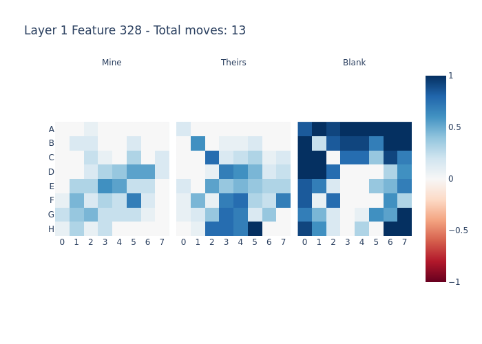
    </td>
    <td style="text-align: center; padding: 10px;">
      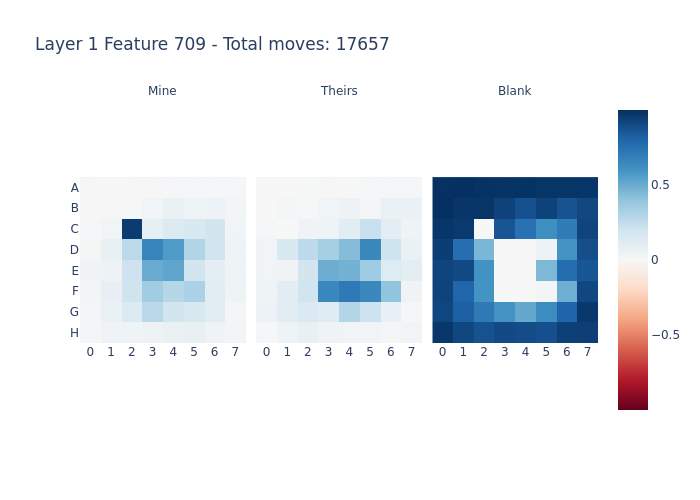
    </td>
  </tr>
</table>

Figure 5. Average board states for the L1E8 SAE. Left: average board state of a 'Theirs' edge tile. Right: a 'Mine' board state feature. 

<table style="width: 100%; margin: auto;">
  <tr>
    <td style="text-align: center; padding: 10px;">
      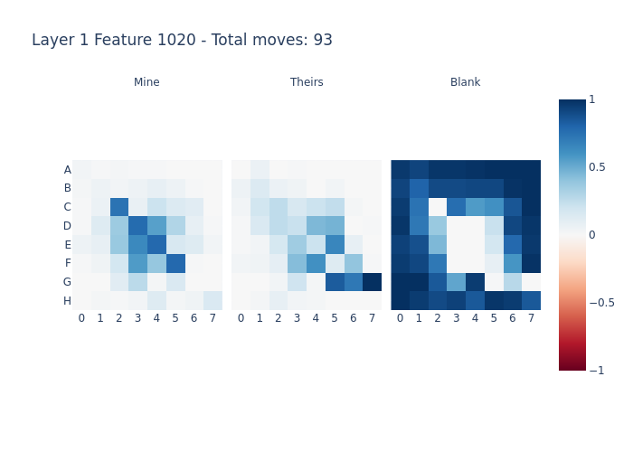
    </td>
    <td style="text-align: center; padding: 10px;">
      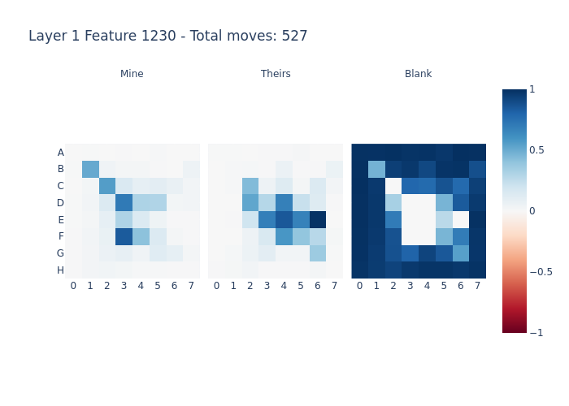
    </td>
  </tr>
</table>

Figure 6.  Average board states for the L1E32 SAE. Left: average board state of a 'Theirs' edge tile. Right: a 'Mine' board state feature.

Among the board state features in Layer 1, I found some that seem to be 'this tile is being played by mine/theirs' features, instead of 'this tile is occupied by mine/theirs'. Figure 7 shows an example of the average board state, along with the top 5 activations of the board states of these moves, illustrating that the tile the feature activates for is the current move being played. The full top 10 boards can be viewed [here](https://github.com/thijmennijdam/Othello-GPT-FeatInterp/tree/main/feature-visualizations/all-features/layer%3D1/expansion_factor%3D32/n_games%3D30000/threshold%3D0.95/L1F3582_total_moves%3D421_M%3D0_T%3D1_B%3D9).

<table style="width: 100%; margin: auto;">
  <tr>
    <td style="text-align: center; padding: 5px;">
      
    </td>
    <td style="text-align: center; padding: 5px;">
      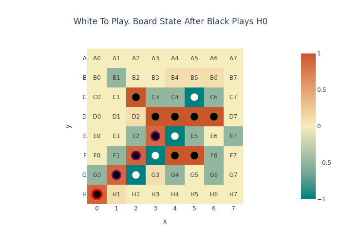
    </td>
    <td style="text-align: center; padding: 5px;">
      
    </td>
  </tr>
  <tr>
    <td style="text-align: center; padding: 5px;">
      
    </td>
    <td style="text-align: center; padding: 5px;">
      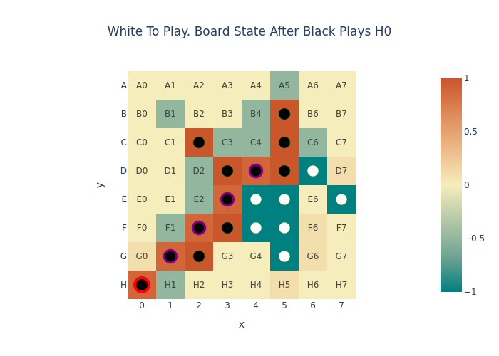
    </td>
    <td style="text-align: center; padding: 5px;">
      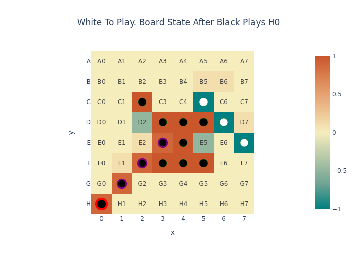
    </td>
  </tr>
</table>

Figure 7. Top row: Average board state for L1E32 feature 3582 (left), and the top 1 and 2 board states that activated this feature the most (middle and right). Bottom row: The top 3, 4, and 5 board states that activated this feature the most.

Beyond 'this tile is occupied by mine/theirs' and 'this tile is being played by mine/theirs' features, both the E8 and E32 variants discover several high-level features that activate heavily on particular game starts, with multiple (around five or more) tiles exceeding the threshold. This pattern is observed across all layers, with one specific game start frequently appearing. The average board states of some of these features are shown in Figure 8. More examples for layer 1 can be found [here](https://github.com/thijmennijdam/Othello-GPT-FeatInterp/tree/main/feature-visualizations/all-features/layer%3D1).

<table style="width: 100%; margin: auto;">
  <tr>
    <td style="text-align: center; padding: 5px;">
      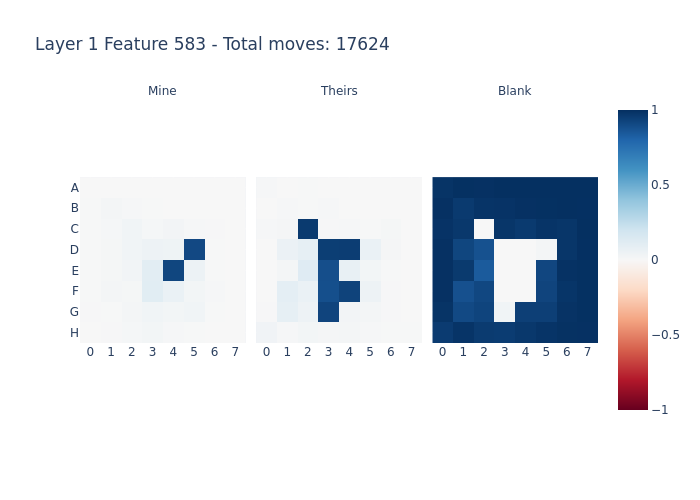
    </td>
    <td style="text-align: center; padding: 5px;">
      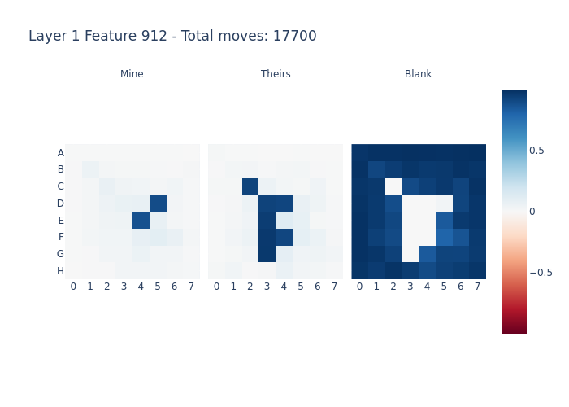
    </td>
    <td style="text-align: center; padding: 5px;">
      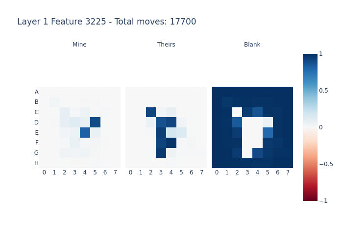
    </td>
  </tr>

</table>

Figure 8. Examples of high-level features for the same game discovered by E8 and E32 variants in Layer 1. Left: An E8 feature. Middle and right: E32 features. 

Lastly, I observed features that detected various patterns. They were found both in L1E8 and L1E32. Several examples are shown in Figure 9. 

<table style="width: 100%; margin: auto;">
  <tr>
    <td style="text-align: center; padding: 10px;">
      
    </td>
    <td style="text-align: center; padding: 10px;">
      
    </td>
    <td style="text-align: center; padding: 10px;">
      
    </td>
  </tr>
<table style="width: 100%; margin: auto;">
  <tr>
    <td style="text-align: center; padding: 10px;">
      
    </td>
    <td style="text-align: center; padding: 10px;">
      
    </td>
    <td style="text-align: center; padding: 10px;">
      
    </td>
  </tr>
</table>

Figure 9. Examples of features that find patterns. First column: The average board states. Second and last column: the top 2 board states that activated this feature the most. 

All of the above features are found in both the E8 and E32 variants. Other than observing more features in E32, which was clear from the quantitative analysis, I observed no clear qualitative differences between the features of E8 and E32.

### Layers 3 and 5

Now turning our attention to the SAEs in layers 3 and 5, I observed that almost all features of the L3E8 and L5E8 variants are high-level features similar to those observed in Layer 1, as shown in Figure 8. Compared to Layer 1 E8 and all the E32 variants, these SAEs mostly fail to extract board state features from the residual stream, other than a few low-quality ones either very early in the game or with only a few samples barely averaging over more than 10 games. These are shown in Figure 10.

<table style="width: 100%; margin: auto;">
  <tr>
    <td style="text-align: center; padding: 10px;">
      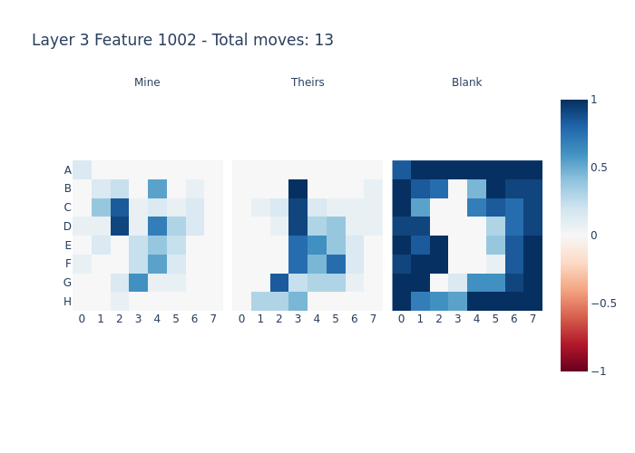
    </td>
    <td style="text-align: center; padding: 10px;">
      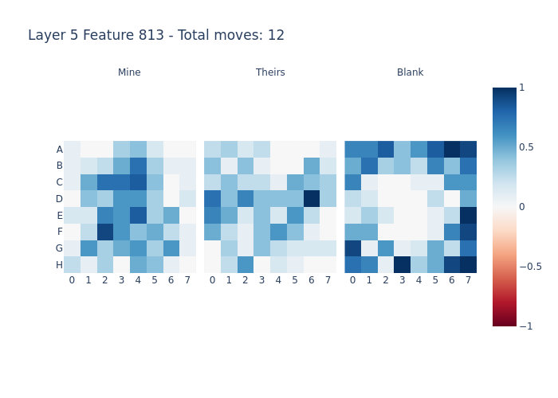
    </td>
    <td style="text-align: center; padding: 10px;">
      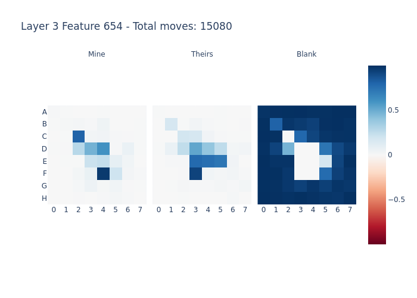
    </td>
  </tr>
</table>

Figure 10. Examples of board state plots extracted from the E8 variants in layers 3 and 5. Apart from the rightmost plot, the few that are found are generally of lower quality.

The E32 variant of the layer 3 and layer 5 SAEs have a few better quality features, shown in Figure 11. Generally, although fewer features are found in these layers and they are of slightly lower quality, the average board states look qualitatively similar to those observed in Layer 1. The only clear difference I observed is that they do not find nearly the same number of edge tile features and patterns that Layer 1 could find, as I only found one edge feature in the L3E32 and L5E32 SAEs (none in the E8 variants). Lastly, I did find some patterns in the features of L3E32, shown in Figure 12, while I could not find any in Layer 5. Apart from this difference, the average board state plots resemble those found in Layer 1, and I did not find many differences between the features across these different layers.

<table style="width: 100%; margin: auto;">
  <tr>
    <td style="text-align: center; padding: 10px;">
      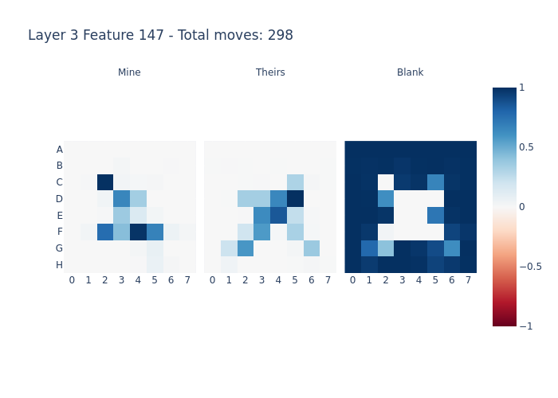
    </td>
    <td style="text-align: center; padding: 10px;">
      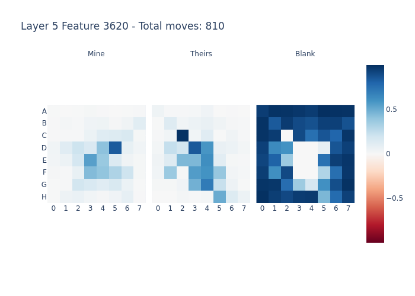
    </td>
  </tr>
</table>

Figure 11. Examples of board state plots extracted from the E32 variants in layers 3 and 5. These features are of slightly better quality than those in the E8 variants.

<table style="width: 100%; margin: auto;">
  <tr>
    <td style="text-align: center; padding: 10px;">
      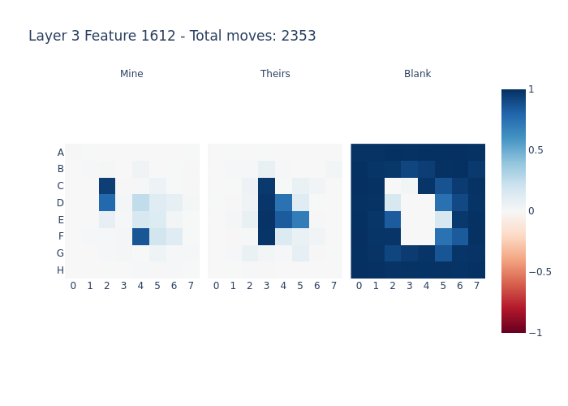
    </td>
    <td style="text-align: center; padding: 10px;">
      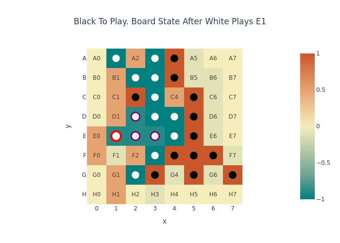
    </td>
    <td style="text-align: center; padding: 10px;">
      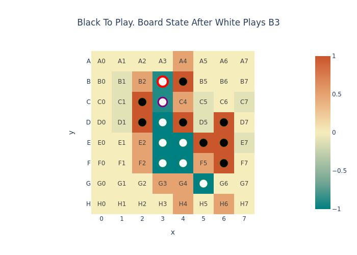
    </td>
  </tr>
  <tr>
    <td style="text-align: center; padding: 10px;">
      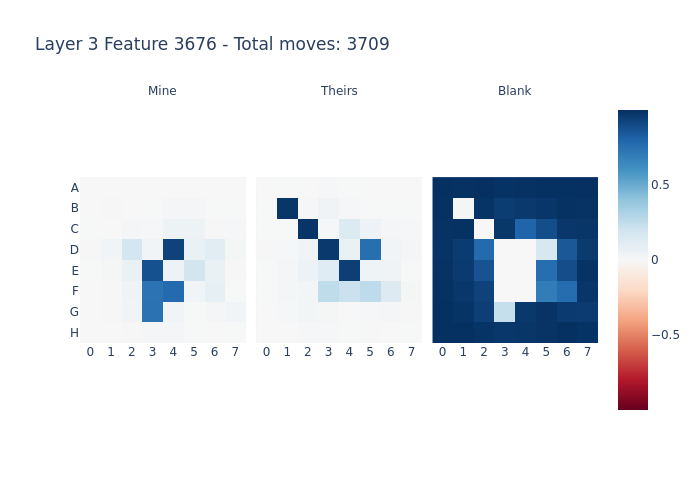
    </td>
    <td style="text-align: center; padding: 10px;">
      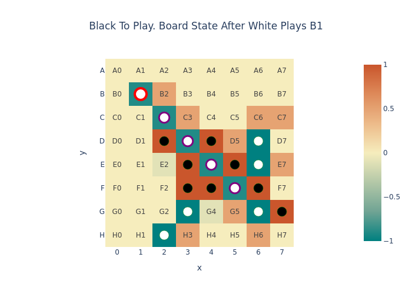
    </td>
    <td style="text-align: center; padding: 10px;">
      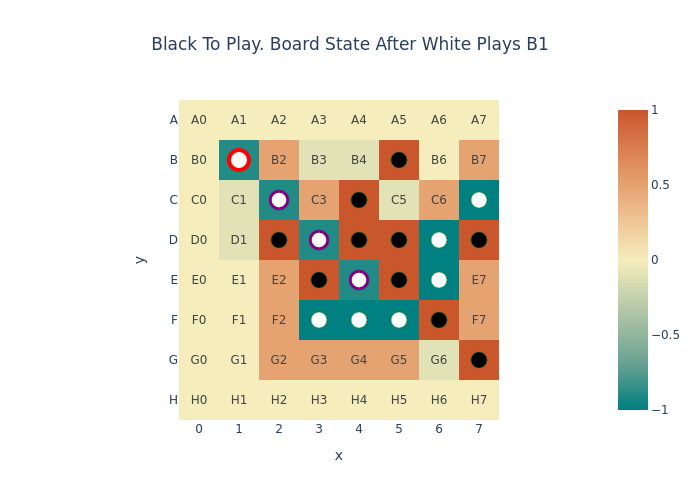
    </td>
  </tr>
</table>

Figure 12. Examples of pattern features discovered in L3E32. Top row: Average board state and the top 2 board states for feature 1612. Bottom row: Average board state and the top 2 board states for feature 3676.

# Discussion

Our exploration of the SAEs across different layers and expansion factors reveals several key insights. Both the E8 and E32 variants identify clear board state features for the middle and edges of the board, with E32 showing a larger number of features, particularly in the earlier layers.

Higher-level features are prevalent across all layers, but in the deeper layers of E32, there is a notable reduction in the number of edge tile features as well as pattern features. While qualitative differences between E8 and E32 are minimal, the increased number of features in E32 facilitates better quality feature discovery. Findings by Hu et al. (2024) [[1]](#1) already showed that 'this tile played' and 'board tile features' are more frequent in the early layers of the network in the attention heads and MLP layers, and this work demonstrates that this is also true for SAEs trained on the residual stream.

There are also some limitations to our approach. One limitation to the fewer features found in later layers could be that we did not optimize sparsity values and trained the SAEs on relatively few samples. It is unclear how much these factors would change the outcomes, but they would most likely have improved the results, as Hu et al. (2024) [[1]](#1) also reported many 'this tile is blank' features in later layers. However, my preliminary investigations showed that my SAEs did not find these. Lastly, our method for extracting notable features is limited, as we only checked for a certain threshold—specifically, a percentage of games where all tiles must be occupied by either 'mine' or 'theirs' to qualify for further inspection. This approach may miss more complex patterns, such as which pieces are flipped by a move or differences in 'mine' and 'theirs' board states that could reveal features indicating legal moves.

# References
<a id="1">[1]</a> He, Z., Ge, X., Tang, Q., Sun, T., Cheng, Q., & Qiu, X. (2024). Dictionary learning Improves Patch-Free circuit Discovery in Mechanistic Interpretability: A case study on Othello-GPT. arXiv.org. https://arxiv.org/abs/2402.12201

<a id="2">[2]</a> Huben, R. (2024). Research Report: Sparse Autoencoders find only 9/180 board state features in OthelloGPT. From AI to ZI. https://aizi.substack.com/p/research-report-sparse-autoencoders

<a id="3">[3]</a> Hazineh, D. S., Zhang, Z., & Chiu, J. (2023). Linear Latent world models in simple transformers: a case study on Othello-GPT. arXiv.org. https://arxiv.org/abs/2310.07582

<a id="4">[4]</a> Nanda, N., Lee, A., & Wattenberg, M. (2023). Emergent linear representations in world models of Self-Supervised Sequence Models. arXiv.org. https://arxiv.org/abs/2309.00941

<a id="5">[5]</a> Li, K., Hopkins, A. K., Bau, D., Viégas, F., Pfister, H., & Wattenberg, M. (2022). Emergent World Representations: exploring a sequence model trained on a synthetic task. arXiv.org. https://arxiv.org/abs/2210.13382

<a id="6">[6]</a> Chiu, J., Hazineh, D., & Zhang, Z. (2023). Probing Emergent world representations in Transformer Networks: Sequential models trained to play Othello. Probing Emergent World Representations in Transformer Networks: Sequential Models Trained to Play Othello. https://deanhazineh.github.io/miniprojects/MI_Othello/paper.pdf

<a id="7">[7]</a> Karvonen, A., Wright, B., Rager, C., Angell, R., Brinkmann, J., Smith, L. R., Verdun, C. M., Bau, D., & Marks, S. (n.d.). Measuring Progress in Dictionary Learning for Language Model Interpretability with Board Game Models. OpenReview. https://openreview.net/forum?id=qzsDKwGJyB

# Appendix

## Hyperparameters of Othello-GPT
TODO
#### Model
TODO

#### Training
TODO

## Hyperparameters of SAEs
TODO

#### Model
TODO

#### Training
TODO

## SAE training
TODO

<table style="width: 100%; margin: auto;">
  <tr>
    <td style="padding: 10px;">
      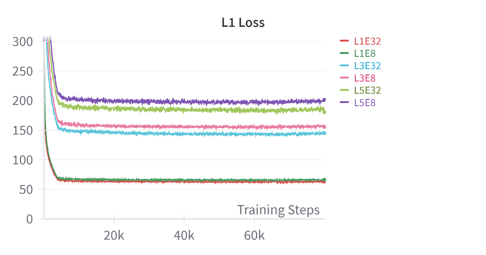
    </td>
    <td style="padding: 10px;">
      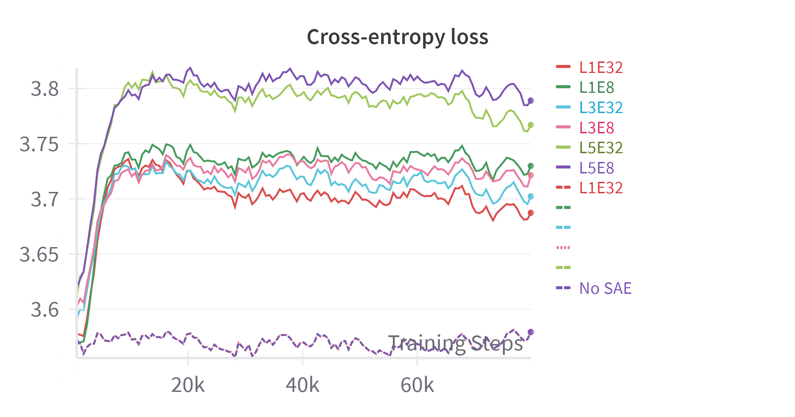
    </td>
  </tr>
</table>

## Multiple high-level feature for the same game starts
TODO
