# Discovering Board State Features in Othello-GPT: A Qualitative Analysis of Sparse Autoencoders

**Abstract**: This study explores the use of Sparse Autoencoders (SAEs) within an Othello-GPT model. We develop a metric for feature extraction and perform an in-depth quantitative and qualitative analysis of the features learned by SAEs across various network layers and expansion factors. Our results demonstrate a progression in feature complexity, starting with basic "current move" detectors in the early layers and evolving into more complex board state features in the later layers. We also identify novel features that activate based on the legality of adjacent tiles. Moreover, this work aims to supports future research by open-sourcing the codebase, enabling the training of Othello-GPTs and SAEs, caching SAE activations, and the analysis of these activations.

 

Recently, training sparse autoencoders (SAEs) to extract interpretable features from language models has gained significant attention in the field of mechanistic interpretability. Training SAEs on model activations aims to address the problem of superposition, where multiple features learned by the model overlap within a single dimension of the internal representation. This phenomenon, known as polysemanticity, complicates the interpretation of model activations. By training SAEs to decompose activations into a sparser representation, insights into model representations can be more easily obtained. However, both training SAEs and interpreting the sparsified model activations remain challenging, as it is unclear a priori which features the model is learning [[1]](#1).

To partially address this, SAEs can be studied in toy models. One popular toy model in the field of mechanistic interpretability is Othello-GPT [[3](#3), [4](#4), [5](#5)]. The transformer decoder-based architecture, similar to that of current large language models, aims to predict the next legal move in an Othello board game when given a sequence of moves. Previous research has shown that Othello-GPT models can perform this task successfully and that, even though the model has no knowledge of the game's rules, a linear probe can be trained on the residual stream activations to reliably predict the current board state [[4]](#4). This means that internally, the model encodes the state of the board linearly simply from its objective to predict the next move. With this, it has been demonstrated that board states can be features present in Othello-GPT, making it a suitable toy model to study the usability of SAEs as a priori there is some knowledge of what features might be present in the model [[2]](#2).

Previous studies have already explored the application of SAEs in the context of Othello-GPT. For instance, He et al. (2024) [[1]](#1) investigated circuit discovery in Othello-GPT, utilizing SAE features to discover a circuit the model uses to understand a local part of the board state around a tile. They also examined features identified by the sparse autoencoders. A research report by Huben (2024) [[2]](#2) focused more specifically on extracting board state features from the SAE model, using the activations of the SAEs as classifiers for board state, assessing the usefulness of SAEs as a technique to discover board state features. Even more recently, Karvonen et al. (2024) [[7]](#7) trained a large number of SAEs on Othello and Chess models, using board reconstruction and the coverage of specified candidate features as proxies to assess the quality of the trained SAEs. 

While these studies primarily focus on the challenges of assessing and improving SAE quality using proxy metrics, they do not extensively analyze the specific features that SAEs trained on Othello-GPT models might exhibit. This research aims to fill this gap by analyzing the features of SAEs, developing a novel metric for feature extraction, and conducting a comprehensive quantitative and qualitative analysis. The key contributions of this study are as follows:

- We open-source a codebase that facilitates the training of Othello-GPTs and SAEs, caching of activations, and extraction and visualization of features, thereby laying the foundation for further experimentation with various techniques to extract and visualize features.
- We develop a simple metric to identify notable features within SAEs.
- We conduct an extensive analysis of the extracted notable features, replicating findings from previous studies and uncovering new features and insights.

# Overview of Othello

Othello is a two-player strategy board game played on an 8x8 grid. Players alternate turns, placing discs of their respective colors—typically black or white—on the board. The primary objective is to capture the opponent's discs by surrounding them vertically, horizontally, or diagonally with one's own discs, thereby flipping the captured discs to one’s color. The game concludes when neither player can make a valid move, and the winner is determined by the player who has the most discs of their color on the board.

Figure 1 illustrates an Othello board, referred to as a **board state**.

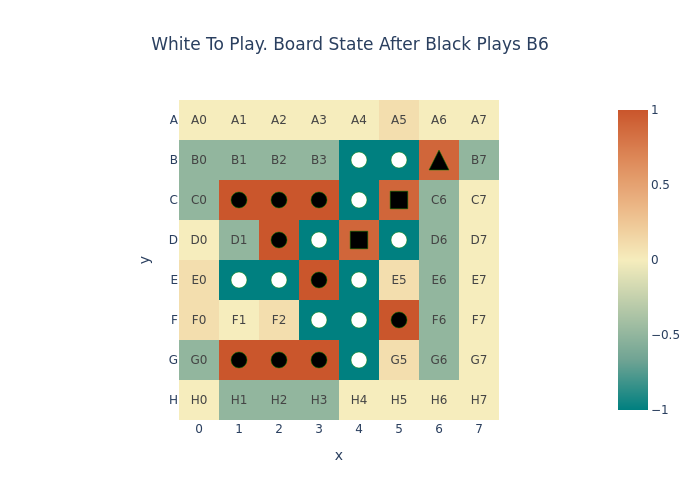

Figure 1: An Othello board state. White pieces are represented with an aqua green color, while black pieces are denoted with red squares. The most recent move is marked by a triangle, and flipped pieces are shown as squares. Legal moves at the current board state are displayed as more transparent versions of their respective colors, aqua green and red.

## Othello-GPT

The foundational research on Othello-GPT was conducted by Li et al. (2023) [[5]](#5), who trained a decoder-only transformer model to predict the next move in an Othello game. They discovered that the model's residual stream could be leveraged to predict the board state by training a non-linear probe on the residual stream activations. Later, Nanda et al. (2023) [[4]](#4) demonstrated that even a linear probe could predict the board state, focusing not on the specific color of the pieces but rather on the ownership of the pieces—whether they belong to the current player (a 'mine' piece) or the opponent (a 'their' piece).

For instance, in Figure 1, since it is white's turn to move, the white pieces would be classified as 'mine' pieces, and the black pieces as 'their' pieces. This approach is a more efficient way of the model to represent the board state, as the same features can be used to predict the board state for both white and black moves. We will use this understanding of 'mine' and 'their' pieces for interpreting the features extracted by SAEs.

# Experimental Setup

To visualize features, access to an Othello-GPT model and its corresponding SAEs is required. The only publicly available Othello-GPT model with SAEs currently has a residual stream dimensionality of 512 and comprises 8 layers. However, prior research indicates that significantly smaller Othello-GPT models, even those with only one layer, can achieve near-perfect top-1 accuracy in predicting legal moves [[3]](#3). Given the focus on directly inspecting SAE features, a smaller model size is preferable for this research. Since such models are not currently publicly available, both the Othello-GPT model and the SAEs were trained from scratch.

The [TransformerLens](https://github.com/TransformerLensOrg/TransformerLens) library is used to train the Othello-GPT model, while the SAEs were trained using [SAELens](https://github.com/jbloomAus/SAELens). SAELens provides a complete training pipeline compatible with models from the TransformerLens library. A notable challenge is the incompatibility of SAELens with locally trained models from TransformerLens, as it only supports official TransformerLens models available on HuggingFace. To enable the use of custom models, several modifications were made to the respective libraries, as documented in this [file](https://github.com/thijmennijdam/Othello-GPT-FeatInterp/blob/main/changes.md). To cache SAE activations efficiently after training, code from the [sae_vis](https://github.com/callummcdougall/sae_vis) library has been adopted.

The dataset used for this research, comprising 23.5 million synthetic Othello games, is publicly [available](https://huggingface.co/datasets/taufeeque/othellogpt) on HuggingFace. It is important to note that in some games, when no legal move is possible, the sequence is padded.

## Othello-GPT
To achieve a balance between realistic architecture and research efficiency, a model configuration is selected with a residual stream dimension of 128 and 6 layers, mirroring the setup used by He et al. (2024) [[1]](#1). The model is trained on 1 million games (59 million tokens/moves) over 5 epochs, achieving a top-1 accuracy of 98.15% in predicting legal moves. Although an accuracy of 99.9% should be attainable with this architectural configuration, as suggested by Hazineh et al. [[3]](#3), achieving such a result would likely require training the model on many more samples (e.g., 10 to 20 times longer) or conducting a grid search on various hyperparameters. Given the constraints on computational resources and time, further optimization was not deemed worthwhile.

## Sparse Autoencoders

SAEs are trained on layers 1, 3, and 5 to observe effects at early, middle, and later stages within the model. Following the methodology of Huben (2024) and Karvonen et al. [[2](#2), [7](#7)], the SAEs are trained on the residual stream. The SAE architecture comprises a one-hidden-layer neural network with ReLU activations, trained with a reconstruction loss and an L1 sparsity penalty to enforce sparse activations. An L1 sparsity penalty of 0.01 is applied uniformly across all SAEs. To assess whether expansion factor size impacts the learned features, two variants of SAEs are trained for each of these layers, with expansion factors of 8 and 16, indicating that the hidden dimension of the SAE is 8 or 16 times larger than the input size. The SAEs are trained on 1.7 million games. From now on, SAEs will be referred to by their layer number and expansion factor, such as L3E16 for the SAE trained on the third layer with an expansion factor of 16.

To assess the SAEs' ability to reconstruct model activations, the mean squared error (MSE) loss is used. As illustrated in Figure 2a, all SAEs, except for L5E8, achieve near-zero MSE loss, indicating high reconstruction accuracy. Notably, the L5E8 SAE exhibits a limited capacity to fully reconstruct the input compared to other SAEs, whereas the E16 variant does not have this limitation. In other layers, both the E8 and E16 variants perform similarly on this metric.

To evaluate the retention of input variance after processing through the SAE, explained variance is also calculated. Results are shown in Figure 2b. All SAEs demonstrate an explained variance greater than 0.999, with L5E8 again performing slightly worse than the others. This outcome is consistent with the higher MSE loss observed for this SAE, naturally resulting in lower explained variance.

To quantify the number of features within the SAE that are never activated, the number of dead features is calculated. A dead feature is defined as one that does not activate across 1,000 input games. Figure 2c shows that SAEs in layer 1 have no dead features, while those in layer 3 and L5E16 exhibit a very small number of dead features. It is generally desirable to have at least some dead features, as this indicates that the SAE is utilizing its maximum capacity and can develop features that are as monosemantic as possible. However, the L1 penalty hyperparameter could likely be optimized for other SAEs that do not display any dead features, potentially leading to improvements in the quality of extracted features. The exploration of this potential optimization is left for future work.

<table>
  <tr>
    <td style="padding: 10px;">
    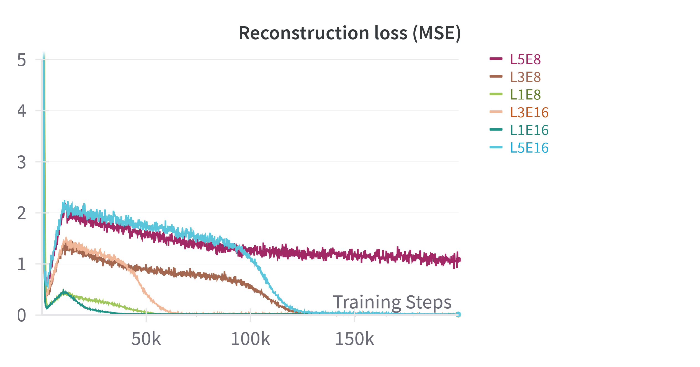
    </td>
    <td style="padding: 10px;">
      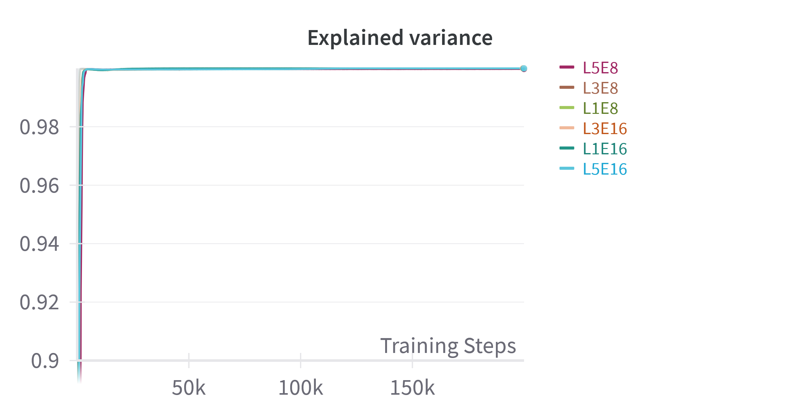
    </td>
    <td style="padding: 10px;">
      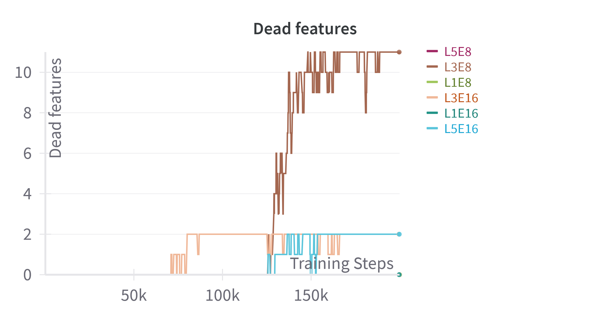
    </td>
  </tr>
</table>

Figure 2. From left to right: (a) Reconstruction error (MSE) across training. (b) Explained variance. (c) Number of dead features.

# Extracting Board State Features From Sparse Autoencoders

Following the training of SAEs on the Othello-GPT model, a method inspired by dictionary learning is employed to associate behaviors with SAE features. This technique, known as [Max Activating Dataset Examples](https://dynalist.io/d/n2ZWtnoYHrU1s4vnFSAQ519J#z=pwjeUj-94p6EwwMO_41Kb3h1), involves running a large dataset through the model to identify inputs that most strongly activate specific neurons. By analyzing these inputs, potential patterns may emerge, suggesting that the respective neuron is detecting these patterns. This approach is applied across all neurons in the six SAEs and serves as the basis for extracting notable features. The full pipeline is as follows:

1. **Running the games:** A set of 25,000 Othello games, each consisting of 60 moves, is processed through the model and SAEs. The number of games is chosen to ensure local storage of the activations. This results in activations of shape `n_games x seq_dim x d_sae`, where `seq_dim=60`, representing the number of moves in Othello games. For each SAE feature, this process yields `60 x 25k = 1.5M` activations, with each activation indicating the feature's activity during the associated move.

2. **Identifying top activations:** The top 1% quantile of all activations for a specific feature is identified, and the corresponding moves are extracted.

3. **Computing board states:** The ground truth board states for these moves are computed using a script capable of playing Othello games based on move sequences, representing the board as a two-dimensional 8x8 array. In this array, `2` denotes white pieces, `1` denotes black pieces, and `0` indicates blank spaces.

4. **Classifying board pieces:** The board configurations are categorized into 'mine' pieces, "theirs" pieces, and "blank" spaces. For instance, if it is white's move, all white pieces on the board are considered 'mine' pieces, and the black pieces are "theirs."

5. **Creating mine/their/blank boards:** These boards are divided into three distinct 8x8 arrays: a 'mine board' marked by `1`s for the mine pieces and `0`s otherwise, a 'their board' showing `1`s for the opposing pieces and `0`s otherwise, and a 'blank board' for empty spaces.

6. **Averaging boards:** By averaging these boards for the three different types, visualizations similar to those in Figure 3 are generated. A dark blue color indicates that the tile is consistently occupied in the top 1% quantile of board states for this feature's activations.

7. **Feature extraction:** A feature is considered notable if a tile is consistently occupied in at least 99% of the board states, meaning the average score is 0.99 or higher. For example, in Figure 3, the B2 square on the 'Theirs' board meets these criteria.

A note on terminology: The B2 tile in Figure 3, which surpasses the threshold, will hereafter be referred to as a **board state property**[^1] (BSP). When this board state property is associated with the current player, it is defined as a **'mine' BSP**, and when associated with the opponent, it is referred to as a **'their' BSP**.

[^1]: This definition of "board state property" is inspired by Karvonen et al. (2024) [[7]](#7) but is used more loosely. Karvonen et al. (2024) [[7]](#7) define it as a classifier of the presence of a piece at a specific board square. Here, it refers to a tile that is consistently occupied in the top 1% quantile of board states for a feature's activations, suggesting that this feature could potentially classify the presence of a piece at this specific board square, although this has not been explicitly tested.

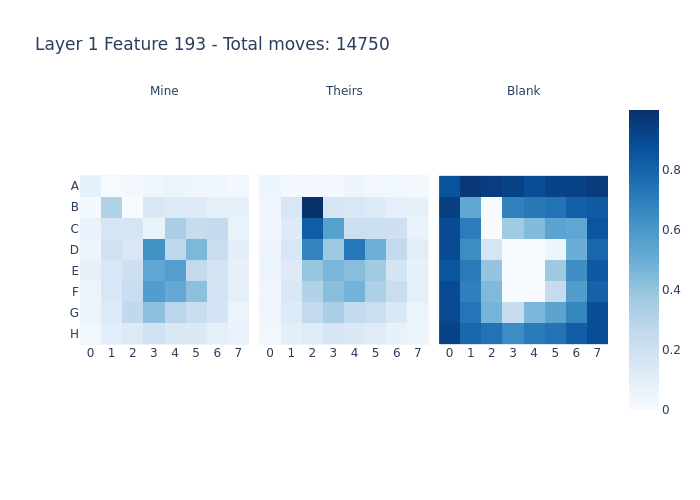

Figure 3: Plot of the average board state of feature 193 in layer 1. The average was taken over 14,750 board states.

# Results
This section presents both quantitative and qualitative results of the extracted features identified using the previously defined metric. This metric identifies features that have a 'mine' or 'their' BSP by focusing on SAE features that, on average, have at least one tile consistently occupied in 99% of the board states computed using the top 1% quantile of move activations for an SAE feature. The quantitative results provide initial insights of the board state features obtained. The qualitative results offer a more in-depth analysis of the types of features identified across different layers. All results are available [here](https://github.com/thijmennijdam/Othello-GPT-FeatInterp/tree/main/plots).

## Quantitative Analysis

In this section, we analyze the quantitative results obtained from extracting notable features. For the E8 SAEs, there are a total of 1,024 features, while the E16 SAEs consist of 2,048 features.

Figure 4a shows the number of extracted notable features across different layers. In the E8 configuration, approximately 270 features are extracted in layer 3, with the layer 5 SAE extracting a bit more than half of that. The layer 1 SAE falls somewhere in between. When comparing this to the E16 SAEs, it is evident that across all layers, these SAEs, which have double the number of neurons, manage to extract more features. In layer 5, the number of extracted features is doubled compared to its E8 counterpart, while in layer 3, there is only a relatively small increase when comparing the E16 to the E8 variant. Overall, it becomes clear that the deeper the E16 SAEs are in the network, the fewer features are extracted.

To examine the distribution of extracted notable features between the current player and the opponent, the cumulative number of BSPs associated with each side is calculated. Figures 4b and 4c present the results for the 'mine' BSPs and 'their' BSPs, respectively. In layer 1, the BSPs are entirely associated with the opponent's board. However, as we move deeper into the network, the presence of 'mine' BSPs gradually increases, while 'their' BSPs decrease. In layer 5, although more BSPs are still allocated to the opponent's board, the distribution becomes relatively balanced.

Given that the E16 SAEs extract the highest number of features and BSPs across all layers, further qualitative investigation will focus on these three SAEs to better understand the observed effects.

<table>
  <tr>
    <td style="padding: 10px;">
      
    </td>
    <td style="padding: 10px;">
      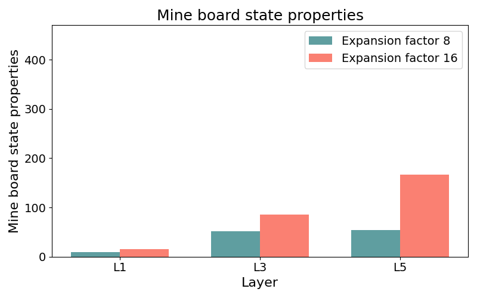
    </td>
    <td style="padding: 10px;">
      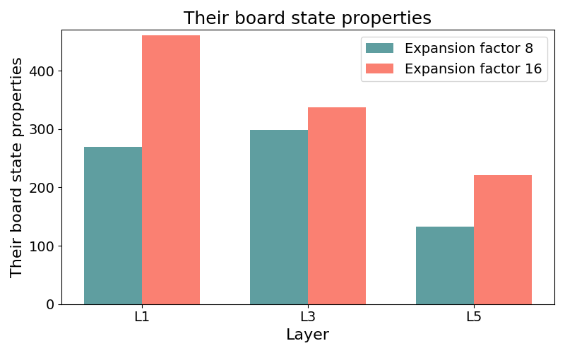
    </td>
  </tr>
</table>

Figure 4. From left to right: (a) Number of extracted notable features across layers, (b) Number of 'mine' BSPs across layers, (c) Number of 'their' BSPs across layers.

## Qualitative Analysis
To explore the observed shift in focus from opponent-related features to self-related features as network depth increases, and to gain further insights into the average board states, each average board state plot is closely examined. This section presents the observations made. Certain features are specific to particular layers, while others are present across multiple layers. The specific results per layer are described first, followed by an analysis of features that are found across multiple layers.

### Layer 1: Current move detectors
As shown in Figures 4b and 4c, layer 1 extracts more features with BSPs focused on the opponent's pieces. When looking at the average board state plots of these notable features, they do indeed primarily display 'their' BSPs, as illustrated in Figures 5 and 6. When examining the top 10 board states that activated these features, it becomes clear that the 'their' BSP often corresponds to the last move played. Thus, most of the features in layer 1 can be described as "current move" features, which is consistent with previous findings [[1]](#1), indicating that early layers tend to focus on "current move" features.

<table style="width: 100%; margin: auto;">
  <tr>
    <td style="text-align: center; padding: 5px;">
      
    </td>
    <td style="text-align: center; padding: 5px;">
      
    </td>
    <td style="text-align: center; padding: 5px;">
      
    </td>
  </tr>
  <tr>
    <td style="text-align: center; padding: 5px;">
      
    </td>
    <td style="text-align: center; padding: 5px;">
      
    </td>
    <td style="text-align: center; padding: 5px;">
      
    </td>
  </tr>
</table>

Figure 5. Top row: Average board state for L1E16 feature 531 (left), and the top 1 and 2 board states that activated this feature the most (middle and right). Bottom row: The top 3, 4, and 5 board states that activated this feature the most.

<table style="width: 100%; margin: auto;">
  <tr>
    <td style="text-align: center; padding: 5px;">
      
    </td>
    <td style="text-align: center; padding: 5px;">
      
    </td>
    <td style="text-align: center; padding: 5px;">
      
    </td>
  </tr>
  <tr>
    <td style="text-align: center; padding: 5px;">
      
    </td>
    <td style="text-align: center; padding: 5px;">
      
    </td>
    <td style="text-align: center; padding: 5px;">
      
    </td>
  </tr>
</table>

Figure 6. Top row: Average board state for L1E16 feature 1580 (left), and the top 1 and 2 board states that activated this feature the most (middle and right). Bottom row: The top 3, 4, and 5 board states that activated this feature the most.

An interesting observation is that multiple "current move" features are extracted which detect the same move. While these features identify the same move, they can differ subtly in their focus. Some features may concentrate on the direction in which the opponent's piece is flipped (e.g., below or to the right), while others may activate strongly regardless of the flipping direction. Figure 7 illustrates this distinction with two features that detect the current move involving the F0 tile. One feature (left) focuses on flipping the top-right piece early in the game, as indicated by the darker average board state for these pieces. The other feature (right) appears to activate more generally when F0 is played, showing a similar blue colors in both flipping directions.

<table style="width: 100%; margin: auto;">
  <tr>
    <td style="text-align: center; padding: 5px;">
      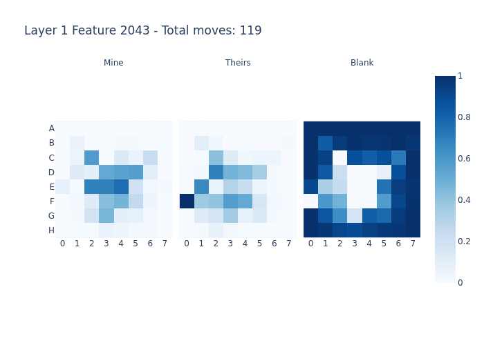
    </td>
    <td style="text-align: center; padding: 5px;">
      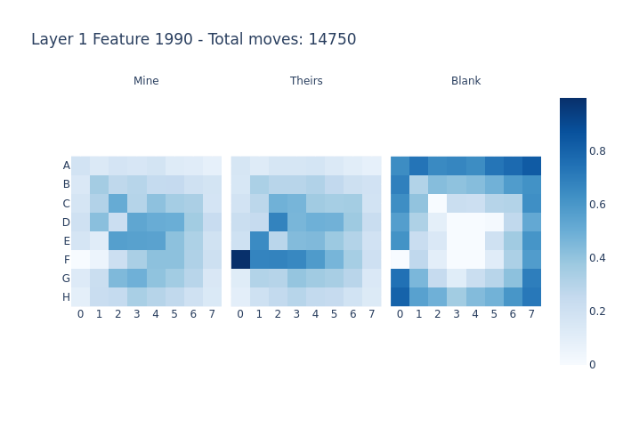
    </td>
  </tr>
</table>

Figure 7. Features 1990 and 2043 detect the same current move involving the F0 tile but display different average board state plots. Notably, feature 2043 has a top 1% quantile of only 119 moves, suggesting it may detect a more specific condition.

### Layer 3: Simple board state features
In layer 3, a transition occurs from the "current move" features that are mainly observed in layer 1 to features that recognize specific board states. These features activate when a particular tile, whether occupied by the opponent or the current player, is in play. Examples of these features are shown in Figures 8 and 9. The top-10 boards for these features typically do not correspond to the last move played; instead, they highlight that specific tiles, corresponding to the detected BSP, are occupied by either the current player or the opponent. These findings align with prior research [[1]](#1), which reported similar features mainly in the middle layers (1-4) of a comparable Othello-GPT network. The presence of most of these features in layer 3, rather than in layer 1, suggests that some level of circuit computation occurs between these layers which enables the recognition of these BSPs.

<table style="width: 100%; margin: auto;">
  <tr>
    <td style="text-align: center; padding: 5px;">
      
    </td>
    <td style="text-align: center; padding: 5px;">
      
    </td>
    <td style="text-align: center; padding: 5px;">
      
    </td>
  </tr>
</table>

Figure 8. Average board state plot and top-2 board states for a feature that activates when the current player occupies the F4 tile.

<table style="width: 100%; margin: auto;">
  <tr>
    <td style="text-align: center; padding: 5px;">
      
    </td>
    <td style="text-align: center; padding: 5px;">
      
    </td>
    <td style="text-align: center; padding: 5px;">
      
    </td>
  </tr>
</table>

Figure 9. Average board state plot and top-2 board states for a feature that activates when the current player occupies the A6 tile.

### Adjacent tile becomes legal features
An interesting type of feature observed in layer 3, and much less frequently in layers 1 and 5, involves features that activate not only when a specific move is played but also when an adjacent tile to that move becomes legal. These features are characterized by average board states showing one 'their' BSP and one blank BSP adjacent to it. When examining the top-10 board states for these features, it becomes evident that in nearly all cases, the blank tile becomes a new legal move for the current player. These features are most commonly observed when the activated tile is near or at the edge of the board. Examples of these features are presented in Figures 10 and 11.

<table style="width: 100%; margin: auto;">
  <tr>
    <td style="text-align: center; padding: 5px;">
      
    </td>
    <td style="text-align: center; padding: 5px;">
      
    </td>
    <td style="text-align: center; padding: 5px;">
      
    </td>
  </tr>
</table>

Figure 10. Example of a feature in layer 3 that activates when an adjacent tile becomes a new legal move for the current player.

<table style="width: 100%; margin: auto;">
  <tr>
    <td style="text-align: center; padding: 5px;">
      
    </td>
    <td style="text-align: center; padding: 5px;">
      
    </td>
    <td style="text-align: center; padding: 5px;">
      
    </td>
  </tr>
</table>

Figure 11. Example of a feature in layer 3 that activates when an adjacent tile becomes a new legal move for the current player. 

### Layer 5: Complex board state features
In layer 5, more complex board state features emerge, activating when both specific "mine" BSPs and specific "their" BSPs are present. These complex features appear alongside the simpler board state features observed earlier in layer 3. Examples of these complex features include features such as "D4 is mine, while F3 is theirs," or features that detect multiple 'mine' BSPs and multiple 'their' BSPs simultaneously. Examples are shown in Figure 12. This finding supports the hypothesis that as network depth increases, the model develops a progressively more comprehensive understanding of the board state.

<table style="width: 100%; margin: auto;">
  <tr>
    <td style="text-align: center; padding: 10px;">
      
    </td>
    <td style="text-align: center; padding: 10px;">
      
    </td>
    <td style="text-align: center; padding: 10px;">
      
    </td>
  </tr>
</table>

Figure 12. Examples of complex board state features. 

## Features present across multiple layers

### Diagonal row detectors
In layers 1 and 3, features are identified that detect diagonal rows of BSPs, with a focus on the opponent's rows rather than those of the current player. Examples of these features are illustrated in Figures 13 and 14 for layers 1 and 3, respectively. Analyzing the top-10 boards for these features reveals that, in all instances shown, the last move was made by the opponent along the diagonal, flipping one of the opponent's pieces in the process. This suggests that these features are a more complex form of the "current move" detectors, activating only when the move results in a flip along the diagonal. These features are more complex than those that simply detect the current move, as they require an understanding of at least two other tiles on the board to determine whether a piece is placed between the opponents pieces and will be flipped. It is interesting that such complex features are observed as early as layer 1.

<table style="width: 100%; margin: auto;">
  <tr>
    <td style="text-align: center; padding: 10px;">
      
    </td>
    <td style="text-align: center; padding: 10px;">
      
    </td>
    <td style="text-align: center; padding: 10px;">
      
    </td>
  </tr>
</table>

Figure 13. Features in layer 1 that activate when a diagonal set of board tiles is occupied by the opponent, leading to the flipping of pieces along the diagonal.

<table style="width: 100%; margin: auto;">
  <tr>
    <td style="text-align: center; padding: 10px;">
      
    </td>
    <td style="text-align: center; padding: 10px;">
      
    </td>
    <td style="text-align: center; padding: 10px;">
      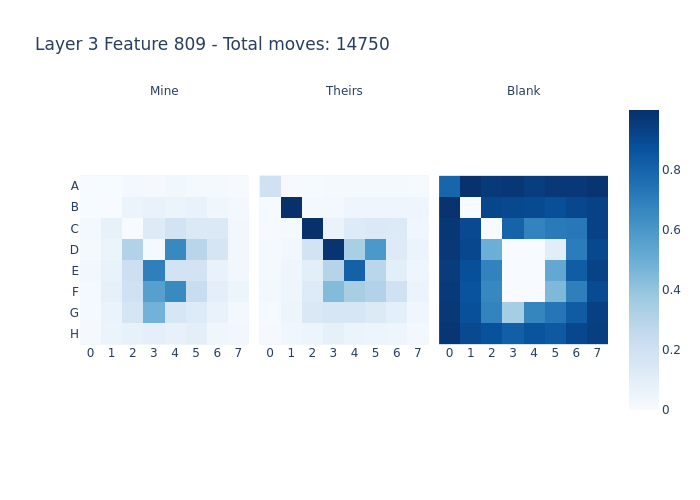
    </td>
  </tr>
</table>

Figure 14. Features in layer 3 that activate when a diagonal set of board tiles is occupied by the opponent, leading to the flipping of pieces along the diagonal.

### Specific game state detectors
Features that activate in response to specific early game states, resulting in average board states characterized by tiles with values of either 1 or 0, are observed uniformly across all layers. These features appear with considerable frequency throughout the network. Two examples of these specific game state detectors for each layer are presented in Figure 15. One game state was detected quite frequently in layer 1 and 3. Figure 16 shows three examples for each layer.

The presence of features that detect specific early game states is intuitive, as they represent an efficient method of encoding information. More intriguing, however, is why these features appear uniformly across the entire network. This suggests that these features are useful in the residual stream throughout most of the network. Future work could explore whether these features are used in early layers for further computation or if they are simply retained for later stages in the network to facilitate easy predictions of legal moves, as the entire board state is already known.

<table style="width: 100%; margin: auto;">
  <tr>
    <td style="text-align: center; padding: 10px;">
      
    </td>
    <td style="text-align: center; padding: 10px;">
      
    </td>
    <td style="text-align: center; padding: 10px;">
      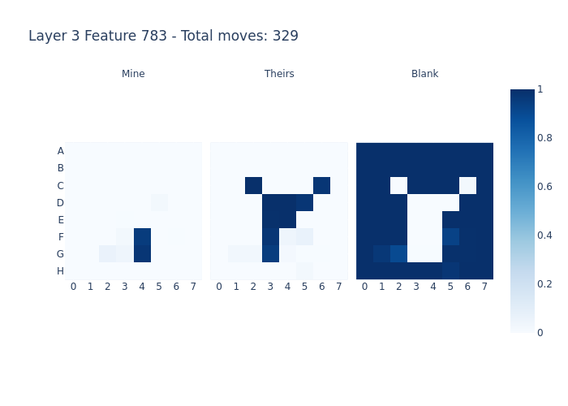
    </td>
  </tr>
  <tr>
    <td style="text-align: center; padding: 10px;">
      
    </td>
    <td style="text-align: center; padding: 10px;">
      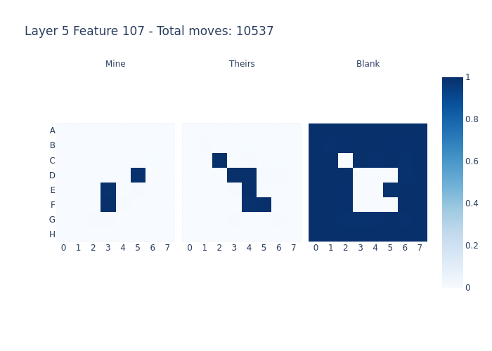
    </td>
    <td style="text-align: center; padding: 10px;">
      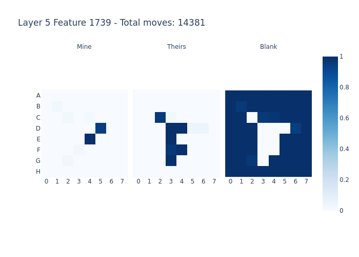
    </td>
  </tr>
</table>

Figure 15. Examples of features across multiple layers that activate in response to early game states.

<table style="width: 100%; margin: auto;">
  <tr>
    <td style="text-align: center; padding: 10px;">
      
    </td>
    <td style="text-align: center; padding: 10px;">
      
    </td>
    <td style="text-align: center; padding: 10px;">
      
    </td>
</tr>
<tr>
    <td style="text-align: center; padding: 5px;">
      
    </td>
    <td style="text-align: center; padding: 5px;">
      
    </td>
    <td style="text-align: center; padding: 5px;">
      
    </td>
  </tr>
</table>

Figure 16. A game state that was detected quite frequently in layer 1 and 3.

### Duplicate features
A significant number of seemingly identical average board states were identified during the analysis of the features. These duplicates were discovered incidentally. Examples of these duplicate features are shown in Figures 17, 18, and 19 for layers 1, 3, and 5, respectively. Notably, layer 1 alone contains multiple identical features, with three nearly identical ones identified, and likely more exist.

No distinct nuances were detected among these features. One possibility is that the duplicates may result from different move sequences leading to the same game state but activating different features. However, this could not be confirmed or disproven based on only the top-10 boards. Future work could involve developing a metric to calculate the mean squared error (MSE) between the average board states to quantify these similarities and investigate whether varying move sequences contribute to the presence of multiple similar features. 

<table style="width: 100%; margin: auto;">
<tr>
<td style="text-align: center; padding: 10px;">
    
</td>
<td style="text-align: center; padding: 10px;">
    
</td>
<td style="text-align: center; padding: 10px;">
    
</td>
</tr>
</table>

Figure 17. Three different features in layer 1 that yield the same average board states for the top activations.

<table style="width: 100%; margin: auto;">
<tr>
<td style="text-align: center; padding: 10px;">
    
</td>
<td style="text-align: center; padding: 10px;">
    
</td>
</tr>
</table>

Figure 18. Different features in layer 3 that yield the same average board states for the top activations.

<table style="width: 100%; margin: auto;">
<tr>
<td style="text-align: center; padding: 10px;">
    
</td>
<td style="text-align: center; padding: 10px;">
    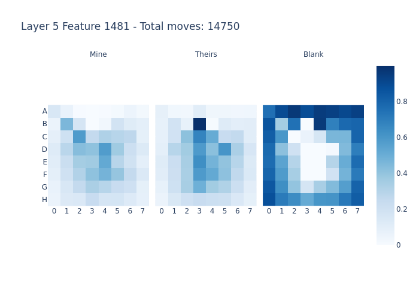
</td>
</tr>
</table>

Figure 19. Different features in layer 5 that yield the same average board states for the top activations.

# Conclusion

The exploration of SAEs across different layers and expansion factors has provided valuable insights into the model's features. Quantitatively, it was observed that as the depth of the network increases, there is a clear shift from features related to recognizing the opponent's tiles to a balance between features focusing on both the opponent and the current player. In the qualitative analysis, this shift in focus was evident as layer 1 features primarily comprised "current move" detectors—features that simply identify the move played by the opponent—while layer 3 introduced simple board state features, and layer 5 revealed more complex features. A novel type of feature was also discovered, primarily in layer 3, which activates when an opponent's move makes an adjacent tile legal. Additionally, intriguing features, such as specific game state detectors and duplicate features, were identified, warranting further investigation.

# Discussion

Despite these findings, several limitations of the current approach must be acknowledged. One such limitation is that the developed algorithm for extracting notable board state features focuses primarily on the presence of a BSP related to either "mine" or "their" pieces, potentially overlooking important criteria. For instance, it does not account for features that consistently activate when flipping specific tiles or those that activate on BSPs that are blank under certain conditions. Previous research [[1]](#1) suggests that later layers can contain features that activate when certain blank squares become legal, an aspect not explored in this study.

Moreover, the qualitative analysis was limited to examining the top-10 boards for each notable feature, without extending the investigation to a larger set, such as the top 1000 board states. This limitation renders the qualitative analysis an initial investigation that highlights several interesting features, but the findings should not be considered conclusive. To draw more definitive conclusions about these features, quantitative methods are needed to analyze the average board states and larger sets of top-k boards associated with these states. For example, a metric could be developed to count how many of the top 1000 boards for a feature involve the current move, whereas in this study, only the top 10 boards were examined. Developing quantitative metrics to support the claims made in this work is an interesting direction for future research. Another example could involve calculating the MSE between average board states to identify similar features.

Lastly, the open-source codebase provided by this work offers a valuable tool for exploring the architectural influences of both Othello-GPT and SAEs. Future research could, for instance, investigate how the size of the residual stream affects the number and complexity of features extracted by SAEs with comparable expansion factors.

By making the code and results fully publicly available, this study aims to lay a foundation for further research in this area. For any questions or further discussion, please feel free to reach out.

# Acknowledgements
I would like to express my sincere gratitude to my supervisor, Leonard Bereska, for his invaluable guidance and support throughout this project. His insights have been instrumental in shaping the direction of this work. I also wish to extend my thanks to Robert Huben for his very thorough and helpful feedback on earlier drafts of this post. 

# References
<a id="1">[1]</a> He, Z., Ge, X., Tang, Q., Sun, T., Cheng, Q., & Qiu, X. (2024). Dictionary learning Improves Patch-Free circuit Discovery in Mechanistic Interpretability: A case study on Othello-GPT. arXiv.org. https://arxiv.org/abs/2402.12201

<a id="2">[2]</a> Huben, R. (2024). Research Report: Sparse Autoencoders find only 9/180 board state features in OthelloGPT. From AI to ZI. https://aizi.substack.com/p/research-report-sparse-autoencoders

<a id="3">[3]</a> Hazineh, D. S., Zhang, Z., & Chiu, J. (2023). Linear Latent world models in simple transformers: a case study on Othello-GPT. arXiv.org. https://arxiv.org/abs/2310.07582

<a id="4">[4]</a> Nanda, N., Lee, A., & Wattenberg, M. (2023). Emergent linear representations in world models of Self-Supervised Sequence Models. arXiv.org. https://arxiv.org/abs/2309.00941

<a id="5">[5]</a> Li, K., Hopkins, A. K., Bau, D., Viégas, F., Pfister, H., & Wattenberg, M. (2022). Emergent World Representations: exploring a sequence model trained on a synthetic task. arXiv.org. https://arxiv.org/abs/2210.13382

<a id="6">[6]</a> Chiu, J., Hazineh, D., & Zhang, Z. (2023). Probing Emergent world representations in Transformer Networks: Sequential models trained to play Othello. Probing Emergent World Representations in Transformer Networks: Sequential Models Trained to Play Othello. https://deanhazineh.github.io/miniprojects/MI_Othello/paper.pdf

<a id="7">[7]</a> Karvonen, A., Wright, B., Rager, C., Angell, R., Brinkmann, J., Smith, L. R., Verdun, C. M., Bau, D., & Marks, S. (n.d.). Measuring Progress in Dictionary Learning for Language Model Interpretability with Board Game Models. OpenReview. https://openreview.net/forum?id=qzsDKwGJyB