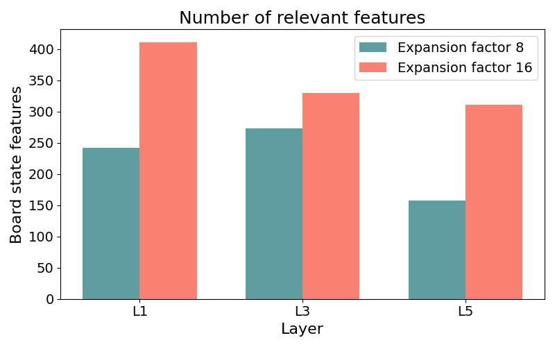

# An Analysis of Sparse Autoencoder Features within Othello-GPT

Recently, training sparse autoencoders (SAEs) to extract interpretable features from language models has gained significant attention in the field of mechanistic interpretability. Training SAEs on model activations aims to address the problem of superposition, where multiple features learned by the model overlap within a single dimension of the internal representation. This phenomenon, known as polysemanticity, complicates the interpretation of model activations. By training SAEs to decompose activations into a sparser representation, insights into model representations can be more easily obtained. However, both training SAEs and interpreting the sparsified model activations remain challenging, as it is unclear a priori which features the model is learning [[1]](#1).

To partially address this, SAEs can be studied in toy models. One popular toy model in the field of mechanistic interpretability is Othello-GPT [[3](#3), [4](#4), [5](#5)]. The transformer decoder-based architecture, similar to that of current large language models, aims to predict the next legal move in an Othello board game when given a sequence of moves. Previous research has shown that, even though the model has no knowledge whatsoever of the rules of the game, a linear probe can be trained on the residual stream activations to reliably predict the current board state [[4]](#4). This means that internally, the model encodes the state of the board linearly simply from its objective to predict the next move. With this, it has been demonstrated that board states can be features present in Othello-GPT, making it a suitable toy model to study the usability of SAEs as a priori there is some knowledge of what features might be present in the model [[2]](#2).

Previous studies have already explored the application of SAEs in the context of Othello-GPT. For instance, He et al. (2024) [[1]](#1) investigated circuit discovery in Othello-GPT, utilizing SAE features to discover a circuit the model uses to understand a local part of the board state around a tile. They also examined features identified by the sparse autoencoders. A research report by Huben (2024) [[2]](#2) focused more specifically on extracting board state features from the SAE model, using the activations of the SAEs as classifiers for board state, assessing the usefulness of SAEs as a technique to discover board state features. Even more recently, Karvonen et al. (2024) [[7]](#7) trained a large number of SAEs on Othello and Chess models, using board reconstruction and the coverage of specified candidate features as proxies to assess the quality of the trained SAEs. 

While these studies primarily address the challenge of assessing SAE quality, they do not extensively analyze the features that SAEs trained on Othello-GPT models may exhibit. This research develops a novel metric for extracting notable features and conducts a comprehensive analysis of these features, both quantitatively and qualitatively. The key contributions of this study are as follows:

- We open-source a codebase that facilitates the training of Othello-GPTs and SAEs, caching of activations, and extraction and visualization of features, thereby laying the foundation for further experimentation with various techniques to extract and visualize features.
- We develop a metric specifically designed to identify notable features within SAEs.
- We conduct an extensive analysis of all extracted features, replicating findings from previous studies and uncovering new features and insights.

# Overview of Othello

Othello is a two-player strategy board game played on an 8x8 grid. Players alternate turns, placing discs of their respective colors—typically black or white—on the board. The primary objective is to capture the opponent's discs by surrounding them vertically, horizontally, or diagonally with one's own discs, thereby flipping the captured discs to one’s color. The game concludes when neither player can make a valid move, and the winner is determined by the player who has the most discs of their color on the board.

Figure 1 illustrates an Othello board, referred to as a **board state**.

Figure 1: An Othello board state. White pieces are represented with an aqua green color, while black pieces are denoted with red squares. The most recent move is marked by a triangle, and flipped pieces are shown as squares. Legal moves at the current board state are displayed as more transparent versions of their respective colors, aqua green and red.

## Othello-GPT

The foundational research on Othello-GPT was conducted by Li et al. (2023) [[5]](#5), who trained a decoder-only transformer model to predict the next move in an Othello game. They discovered that the model's residual stream could be leveraged to predict the board state by training a non-linear probe on the residual stream activations. Later, Nanda et al. (2023) [[4]](#4) demonstrated that even a linear probe could predict the board state, focusing not on the specific color of the pieces but rather on the ownership of the pieces—whether they belong to the current player (a 'mine' piece) or the opponent (a 'their' piece).

For instance, in Figure 1, since it is white's turn to move, the white pieces would be classified as 'mine' pieces, and the black pieces as 'their' pieces. This approach is a more efficient way of the model to represent the board state, as the same features can be used to predict the board state for both white and black moves. We will use this understanding of 'mine' and 'their' pieces for interpreting the features extracted by SAEs.

# Experimental Setup

To visualize features, access to an Othello-GPT model and its corresponding SAEs is required. The only publicly available Othello-GPT model with SAEs currently has a residual stream dimensionality of 512 and comprises 8 layers. However, prior research indicates that significantly smaller Othello-GPT models, even those with only one layer, can achieve near-perfect top-1 accuracy in predicting legal moves [[3]](#3). Given the focus on directly inspecting SAE features, a smaller model size is preferable for this research. Since such models are not currently publicly available, both the Othello-GPT model and the SAEs were trained from scratch.

The [TransformerLens](https://github.com/TransformerLensOrg/TransformerLens) library is used to train the Othello-GPT model, while the SAEs were trained using [SAELens](https://github.com/jbloomAus/SAELens). SAELens provides a complete training pipeline compatible with models from the TransformerLens library. A notable challenge is the incompatibility of SAELens with locally trained models from TransformerLens, as it only supports official TransformerLens models available on HuggingFace. To enable the use of custom models, several modifications were made to the respective libraries, as documented in this [file](https://github.com/thijmennijdam/Othello-GPT-FeatInterp/blob/main/changes.md).

The dataset used for this research, comprising 23.5 million synthetic Othello games, is publicly [available](https://huggingface.co/datasets/taufeeque/othellogpt) on HuggingFace.

## Othello-GPT

To achieve a balance between realistic architecture and research efficiency, a model configuration is selected with a residual stream dimension of 128 and 6 layers, mirroring the setup used by He et al. (2024) [[1]](#1). The model is trained on 1 million games (59 million tokens/moves) over 5 epochs, achieving an accuracy of 98.15%.

## Sparse Autoencoders

SAEs are trained on layers 1, 3, and 5 to observe effects at early, middle, and later stages within the model. Following the methodology of Huben (2024) and Karvonen et al. [[2](#2), [7](#7)], SAEs are trained on the residual stream. The SAE architecture comprises a one-hidden-layer neural network with ReLU activations, trained with a reconstruction loss and an L1 sparsity penalty to enforce sparse activations. An L1 sparsity penalty of 0.01 is applied uniformly across all SAEs. To assess whether expansion factor size impacts the learned features, two variants of SAEs are trained for each of these layers, with expansion factors of 8 and 16, indicating that the hidden dimension of the SAE is 8 or 16 times larger than the input size. The SAEs are trained on 1.7 million games. From now on, SAEs will be referred to by their layer number and expansion factor, such as L3E16 for the SAE trained on the third layer with an expansion factor of 16.

The mean squared error (MSE) loss is used to assess the SAEs' ability to reconstruct model activations. As illustrated in Figure 2a, all SAEs, except for L5E8, achieve near-zero MSE loss, indicating high reconstruction accuracy. Notably, the L5E8 SAE exhibits a limited capacity to fully reconstruct the input compared to other SAEs, whereas the E16 variant does not have this limitation. In other layers, both the E8 and E16 variants perform similarly on this metric.

To evaluate the retention of input variance after processing through the SAE, explained variance is also calculated. Results are shown in Figure 2b. All SAEs demonstrate an explained variance greater than 0.999, with L5E8 again performing slightly worse than the others. This outcome is consistent with the higher MSE loss observed for this SAE, naturally resulting in lower explained variance.

To quantify the number of features within the SAE that are never activated, the number of dead features is calculated. A dead feature is defined as one that does not activate across 1,000 input games. Figure 2c shows that SAEs in layer 1 have no dead features, while SAEs in layer 3 and L5E16 exhibit a very small number of dead features.

<table>
  <tr>
    <td style="padding: 10px;">
    
    </td>
    <td style="padding: 10px;">
      
    </td>
    <td style="padding: 10px;">
      
    </td>
  </tr>
</table>

Figure 2. From left to right: (a) Reconstruction error (MSE) across training. (b) Explained variance. (c) Number of dead features.

# Extracting Board State Features From Sparse Autoencoders

Following the training of SAEs on the Othello-GPT model, a method inspired by dictionary learning is employed to associate behaviors with SAE features. This technique, known as [Max Activating Dataset Examples](https://dynalist.io/d/n2ZWtnoYHrU1s4vnFSAQ519J#z=pwjeUj-94p6EwwMO_41Kb3h1), involves running a large dataset through the model to identify inputs that most strongly activate specific neurons. By analyzing these inputs, potential patterns may emerge, suggesting that a feature is detecting these patterns. This approach is applied across all features in the six SAEs and serves as the basis for extracting notable features. The full pipeline is as follows:

1. **Running the games:** A set of 25,000 Othello games, each consisting of 60 moves, is processed through the model and SAEs. The number of games is chosen to ensure local storage of the activations. This results in activations of shape `n_games x seq_dim x d_sae`, where `seq_dim=60`, representing the number of moves in Othello games. For each SAE feature, this process yields `60 x 25k = 1.5M` activations, with each activation indicating the feature's activity during the associated move.

2. **Identifying top activations:** The top 1% quantile of all activations for a specific feature is identified, and the corresponding moves are extracted.

3. **Computing board states:** The ground truth board states for these moves are computed using a script capable of playing Othello games based on move sequences, representing the board as a two-dimensional 8x8 array. In this array, `2` denotes white pieces, `1` denotes black pieces, and `0` indicates blank spaces.

4. **Classifying board pieces:** The board configurations are categorized into "mine" pieces, "theirs" pieces, and "blank" spaces. For instance, if it is white's move, all white pieces on the board are considered "mine" pieces, and the black pieces are "theirs."

5. **Creating mine/their/blank boards:** These boards are divided into three distinct 8x8 arrays: a 'mine board' marked by `1`s for the mine pieces and `0`s otherwise, a 'their board' showing `1`s for the opposing pieces and `0`s otherwise, and a 'blank board' for empty spaces.

6. **Averaging boards:** By averaging these boards for the three different types, visualizations similar to those in Figure 3 are generated. A dark blue color indicates that the tile is consistently occupied in the top 1% quantile of board states for this feature's activations.

7. **Feature extraction:** A feature is considered notable if a tile is consistently occupied in at least 99% of the board states, meaning the average score is 0.99 or higher. For example, in Figure 3, the B2 square on the 'Theirs' board meets these criteria.

The B2 tile, which surpasses the threshold, is referred to as a **board state property**[^1] (BSP). When this board state property is associated with the current player, it is defined as a **'mine' BSP**, and when associated with the opponent, it is recognized as a **'their' BSP**.

[^1]: This definition of "board state property" is inspired by Karvonen et al. (2024) [[7]](#7) but is used more loosely. Karvonen et al. (2024) [[7]](#7) define it as a classifier of the presence of a piece at a specific board square. Here, it refers to a tile that is consistently occupied in the top 1% quantile of board states for a feature's activations, suggesting that this feature could potentially classify the presence of a piece at this specific board square, although this has not been explicitly tested.

Figure 3: Plot of the average board state of feature 193 in layer 1. The average was taken over 14,750 board states.

# Results
This section presents both quantitative and qualitative results of the extracted features identified using the previously defined threshold metric. This metric identifies features that have a "mine" or "their" BSP by focusing on SAE features that, on average, have at least one tile consistently occupied in 99% of the board states computed using the top 1% quantile of move activations for an SAE feature. The quantitative results provide initial insights and a high-level understanding of the board state features obtained. The qualitative results offer a more in-depth analysis of the types of features identified across different layers. The average board states, along with the top-10 boards for all six SAEs identified using this metric, are available [here](https://github.com/thijmennijdam/Othello-GPT-FeatInterp/tree/main/plots/qualitative).

## Quantitative Analysis
In this section, quantitative results obtained when extracting notable features are analyzed. For the E8 SAEs, there are a total of 128 * 8 = 1024 features, whereas for the E16 SAEs, this is double, amounting to 2048 features.

By counting the number of extracted features, it is observed in Figure 4a that for the E8 configuration, approximately 270 features are extracted in layer 3, with the layer 5 SAE extracting around half that amount, and the layer 1 SAE falling in between. Comparing this to the E16 SAEs, it is evident that across all layers, these SAEs extract more features. For layer 5, the number of extracted features is doubled, while in layer 3, there is only a relatively small increase. Overall, the deeper the E16 SAEs are in the network, the fewer features are extracted under the given hyperparameter settings for this metric. These results align with previous findings [[1]](#1), where earlier layers tend to focus on board state features, while later layers concentrate more on the blank features that represent legal moves.

To examine the distribution of extracted notable features between the current player and the opponent, the cumulative number of BSPs associated with each side was analyzed. The results are shown in Figures 4b and 4c for the "mine" BSPs and "their" BSPs, respectively. In layer 1, the BSPs are entirely associated with the opponent's board. However, as one moves deeper into the network, the presence of "mine" BSPs gradually increases, while "their" BSPs decrease. In layer 5, although more BSPs are still allocated to the opponent's board, the distribution is relatively balanced. 

As the E16 SAEs extract the highest number of features and BSPs across all layers, the focus of further qualitative investigation will be on these three SAEs to better understand the observed effects.

<table>
  <tr>
    <td style="padding: 10px;">
      
    </td>
    <td style="padding: 10px;">
      
    </td>
    <td style="padding: 10px;">
      
    </td>
  </tr>
</table>

Figure 4. From left to right: (a) Features with at least one active 'Mine' or 'Theirs' tile across different layers, (b) Average number of 'Mine' or 'Theirs' tiles per feature, (c) Average game length of the features identified.

## Qualitative Analysis
To explore the observed shift in focus from opponent-related features to self-related features as the network depth increases, and to gain further insights into the average board states, each average board state plot was closely examined. This section presents the observations made. It was found that certain features are specific to particular layers, while others are present across multiple layers. The specific results per layer are described first, followed by an analysis of features that were found across multiple layers.

### Layer 1: Current move detector features
As observed in Figures 4b and 4c, layer 1 has more extracted features with BSPs focused on the opponent's pieces. The average board state plots of these notable features primarily show "their" BSPs, as illustrated in Figures 5 and 6. When examining the top-10 boards of these features, it is clear that the BSP is often the last move played. Thus, most of the features in layer 1 can be described as "current move" features, which is consistent with previous findings [[1]](#1), indicating that early layers tend to focus on "current move" features.

<table style="width: 100%; margin: auto;">
  <tr>
    <td style="text-align: center; padding: 5px;">
      
    </td>
    <td style="text-align: center; padding: 5px;">
      
    </td>
    <td style="text-align: center; padding: 5px;">
      
    </td>
  </tr>
  <tr>
    <td style="text-align: center; padding: 5px;">
      
    </td>
    <td style="text-align: center; padding: 5px;">
      
    </td>
    <td style="text-align: center; padding: 5px;">
      
    </td>
  </tr>
</table>

Figure 5. Top row: Average board state for L1E16 feature 531 (left), and the top 1 and 2 board states that activated this feature the most (middle and right). Bottom row: The top 3, 4, and 5 board states that activated this feature the most.

<table style="width: 100%; margin: auto;">
  <tr>
    <td style="text-align: center; padding: 5px;">
      
    </td>
    <td style="text-align: center; padding: 5px;">
      
    </td>
    <td style="text-align: center; padding: 5px;">
      
    </td>
  </tr>
  <tr>
    <td style="text-align: center; padding: 5px;">
      
    </td>
    <td style="text-align: center; padding: 5px;">
      
    </td>
    <td style="text-align: center; padding: 5px;">
      
    </td>
  </tr>
</table>

Figure 6. Top row: Average board state for L1E16 feature 1580 (left), and the top 1 and 2 board states that activated this feature the most (middle and right). Bottom row: The top 3, 4, and 5 board states that activated this feature the most.

Multiple "current move" features were identified that detect the same move. A subtle distinction is that some features appear to focus on the current move flipping a piece in a specific direction (e.g., below or to the right), although this was not always clear, as some show only minor discrepancies between the average board states of these features. Figure 7 illustrates two average board state plots from different features, that are associated with the same current move, the F0 tile. Notably, feature 2043 has a top 1% quantile of only 119 moves, suggesting it may detect more specific conditions, such as whether the tile at E1 (top right of F0) is flipped. While feature 1990 has a top 1% activation on a larger number of games, likely detecting more general conditions when F0 is played.

<table style="width: 100%; margin: auto;">
  <tr>
    <td style="text-align: center; padding: 5px;">
      
    </td>
    <td style="text-align: center; padding: 5px;">
      
    </td>
  </tr>
</table>

Figure 7. Feature 1990 and 2043 detecting the same current move played, the F0 tile. With different average board state plots. Notably the 2043 feature only has a top 1% quantile of 119 moves, making it possible to detect a niche feature. 

### Layer 3: simple board state features

In layer 3, a transition is observed from primarily "current move" features in Layer 1 to features recognizing specific board states. These features activate when a particular tile, either belonging to the opponent or the current player, is occupied. Examples are provided in Figures 8 and 9. The top-10 boards for these features do not typically correspond to the last move played, but rather that specific tiles are occupied by either the current player or the opponent. These findings are consistent with prior research [[1]](#1), which reported similar features mainly in middle layers (1-4) of a similar Othello-GPT network. The presence of most of these features in layer 3, rather than layer 1, suggests that some level of circuit computation occurs between these layers, which enables this recognition of these BSPs.

<table style="width: 100%; margin: auto;">
  <tr>
    <td style="text-align: center; padding: 5px;">
      
    </td>
    <td style="text-align: center; padding: 5px;">
      
    </td>
    <td style="text-align: center; padding: 5px;">
      
    </td>
  </tr>
</table>

Figure 8. Average board state plot, along with top-2 board states of feature that activates when current player occupies the F4 tile. 

<table style="width: 100%; margin: auto;">
  <tr>
    <td style="text-align: center; padding: 5px;">
      
    </td>
    <td style="text-align: center; padding: 5px;">
      
    </td>
    <td style="text-align: center; padding: 5px;">
      
    </td>
  </tr>
</table>

Figure 9. Average board state plot, along with top-2 board states of feature that activates when current player occupies the A6 tile. 

### Adjacent tile becomes legal features
An interesting type of feature observed in layer 3, and much less frequently in layers 1 and 5, involves features that activate not only when a particular move is played but also when an adjacent tile to that move becomes legal. These features are characterized by average board states with one "their" BSP and one blank BSP adjacent to it. When examining the top 10 board states for these features, it is evident that in nearly all cases, the blank tile becomes a new legal move for the current player. These features are most commonly observed when the activated tile is near or at the edge of the board. Examples of these features are presented in Figures 10 and 11.

<table style="width: 100%; margin: auto;">
  <tr>
    <td style="text-align: center; padding: 5px;">
      
    </td>
    <td style="text-align: center; padding: 5px;">
      
    </td>
    <td style="text-align: center; padding: 5px;">
      
    </td>
  </tr>
</table>

Figure 10. TODO 

<table style="width: 100%; margin: auto;">
  <tr>
    <td style="text-align: center; padding: 5px;">
      
    </td>
    <td style="text-align: center; padding: 5px;">
      
    </td>
    <td style="text-align: center; padding: 5px;">
      
    </td>
  </tr>
</table>

Figure 11. TODO 

### Layer 5: Complex board state features
In layer 5, features that activate when both specific "mine" BSPs and specific "their" BSPs are present were identified, indicating more complex board state features. Examples include features such as "D4 is mine, while F3 is theirs" or features detecting multiple "mine" BSPs and multiple "their" BSPs simultaneously. Examples are shown in Figure 12. This finding supports the hypothesis that as the network depth increases, the model progressively develops a more complex understanding of the board state by composing more complex features.

<table style="width: 100%; margin: auto;">
  <tr>
    <td style="text-align: center; padding: 10px;">
      
    </td>
    <td style="text-align: center; padding: 10px;">
      
    </td>
    <td style="text-align: center; padding: 10px;">
      
    </td>
  </tr>
</table>

Figure 12. TODO 

## Features present across multiple layers 

### Diagonal row detector features
In layers 3 and 5, features were identified that detect diagonal rows of BSP features, predominantly detecting the opponent's rows rather than the current player's. 

In layers 3 & 5, features were found that detect a diagonal row of BSP features. Interestingly, they are mostly detecting the enemies rows instead of the rows of the current player. 

<table style="width: 100%; margin: auto;">
  <tr>
    <td style="text-align: center; padding: 10px;">
      
    </td>
    <td style="text-align: center; padding: 10px;">
      
    </td>
    <td style="text-align: center; padding: 10px;">
      
    </td>
  </tr>
</table>

Figure 13. Features in layer 3 that activate when an adjacent diagonal set of board tiles is occupied by the opponent. 

<table style="width: 100%; margin: auto;">
  <tr>
    <td style="text-align: center; padding: 10px;">
      
    </td>
    <td style="text-align: center; padding: 10px;">
      
    </td>
    <td style="text-align: center; padding: 10px;">
      
    </td>
  </tr>
</table>

Figure 14. Features in layer 5 that activate when an adjacent diagonal set of board tiles is occupied by the opponent. 

### Specific game state detectors
Features that activate in response to specific early game states, resulting in average board states characterized by tiles with values of either 1 or 0, were observed uniformly across all layers. These features appeared with considerable frequency throughout the network. Two examples of these features for each layer are presented in Figure 15. The presence of features that detect specific early game states is intuitive, as they represent an efficient method of encoding information. However, the uniform distribution of these features across all layers is less intuitive and warrants further investigation. 

<table style="width: 100%; margin: auto;">
  <tr>
    <td style="text-align: center; padding: 10px;">
      
    </td>
    <td style="text-align: center; padding: 10px;">
      
    </td>
    <td style="text-align: center; padding: 10px;">
      
    </td>
  </tr>
  <tr>
    <td style="text-align: center; padding: 10px;">
      
    </td>
    <td style="text-align: center; padding: 10px;">
      
    </td>
    <td style="text-align: center; padding: 10px;">
      
    </td>
  </tr>
</table>

Figure 15. Different features in across multiple layers that activate for early state of a game. 

<table style="width: 100%; margin: auto;">
  <tr>
    <td style="text-align: center; padding: 10px;">
      
    </td>
    <td style="text-align: center; padding: 10px;">
      
    </td>
    <td style="text-align: center; padding: 10px;">
      
    </td>
</tr>
<tr>
    <td style="text-align: center; padding: 5px;">
      
    </td>
    <td style="text-align: center; padding: 5px;">
      
    </td>
    <td style="text-align: center; padding: 5px;">
      
    </td>
  </tr>
</table>

Figure 16. TODO 

## Duplicate features
A significant number of seemingly identical average board states were identified during the sequential analysis of features. These duplicates were often discovered either incidentally or due to their proximity, making them easier to recognize when reviewing the plots. Examples of these duplicate features are illustrated in Figures 17, 18, and 19 for layers 1, 3, and 5, respectively. Notably, layer 1 alone contains multiple identical features, with three nearly identical ones identified, and likely more exist. Additionally, a specific early game state with numerous features dedicated to it was observed across multiple layers, as shown in Figure 16. More examples of these duplicate features are provided in the appendix.

While no distinct nuances were detected among these features, it is speculated that the duplicates may result from different move sequences leading to the same game state but activating different features. This hypothesis remains speculative. Future work could involve developing a metric to calculate the mean squared error (MSE) between the average board states to quantify these similarities and investigate whether varying move sequences contribute to the presence of multiple similar features.

<table style="width: 100%; margin: auto;">
<tr>
<td style="text-align: center; padding: 10px;">
    
</td>
<td style="text-align: center; padding: 10px;">
    
</td>
<td style="text-align: center; padding: 10px;">
    
</td>
</tr>
</table>

Figure 9. Different features that yield the same average board states of the top activations 

<table style="width: 100%; margin: auto;">
<tr>
<td style="text-align: center; padding: 10px;">
    
</td>
<td style="text-align: center; padding: 10px;">
    
</td>
</tr>
</table>

Figure 9. Different features that yield the same average board states of the top activations 

<table style="width: 100%; margin: auto;">
<tr>
<td style="text-align: center; padding: 10px;">
    
</td>
<td style="text-align: center; padding: 10px;">
    
</td>
</tr>
</table>

Figure 9. Different features that yield the same average board states of the top activations 

# Conclusion
The exploration of SAEs across different layers and expansion factors has yielded several key insights. As the depth of the network increases, there is a notable shift in focus from features related to the opponent to those associated with the current player. Additionally, the replication of several features identified in earlier studies, such as those detecting the "current move" and the occupancy of specific tiles by either the current player or the opponent, was successful. A new type of feature was also discovered, primarily in layer 3, which activates when a move is made, and an adjacent tile becomes legal. Furthermore, certain features were found consistently across multiple layers, and some appeared to be duplicates, often activating strongly in games that resulted in similar average board states.

# Discussion 
Despite these findings, several limitations to the current approach are acknowledged. The algorithm used for extracting notable board state features focuses narrowly on the presence of a board state property to identify significant moves, excluding other criteria that could be important. For instance, the algorithm does not account for features that consistently flip specific tiles or consider the board state properties of blank features, which were not included in the current analysis. Previous research [[1]](#1) has suggested that later layers can contain features that activate when certain blank squares become legal, indicating that the current method might overlook some aspects of the model's behavior.

Additionally, the analysis was limited to examining the top-10 boards for each notable feature, without extending the investigation to a larger set, such as the top 1000 board states. This limitation renders some observations inconclusive and highlights the need for further research.

Future work could involve developing metrics to quantify the features identified qualitatively in this study. For example, calculating the mean squared error (MSE) between average board states could help identify similar features, or thresholds could be established for "current move" features based on how frequently the last move matches the identified board state property. Similar metrics could also be developed for other types of features. Moreover, the open-source codebase provided by this study offers a valuable tool for exploring the architectural influences of both Othello-GPT and SAEs. For instance, future research could investigate how the size of the residual stream affects the number of features extracted by SAEs with comparable expansion factors.

By making the code available, this study aims to provide an accessible foundation for further research in this area. For any questions or further discussion, readers are encouraged to reach out.

# Acknowledgements
I would like to express my sincere gratitude to my supervisor, Leonard Bereska, for his invaluable guidance and support throughout this project. His insights have been instrumental in shaping the direction of this work. I also wish to extend my thanks to Robert Huben for his very thorough and helpful feedback on earlier drafts of this post.

# References
<a id="1">[1]</a> He, Z., Ge, X., Tang, Q., Sun, T., Cheng, Q., & Qiu, X. (2024). Dictionary learning Improves Patch-Free circuit Discovery in Mechanistic Interpretability: A case study on Othello-GPT. arXiv.org. https://arxiv.org/abs/2402.12201

<a id="2">[2]</a> Huben, R. (2024). Research Report: Sparse Autoencoders find only 9/180 board state features in OthelloGPT. From AI to ZI. https://aizi.substack.com/p/research-report-sparse-autoencoders

<a id="3">[3]</a> Hazineh, D. S., Zhang, Z., & Chiu, J. (2023). Linear Latent world models in simple transformers: a case study on Othello-GPT. arXiv.org. https://arxiv.org/abs/2310.07582

<a id="4">[4]</a> Nanda, N., Lee, A., & Wattenberg, M. (2023). Emergent linear representations in world models of Self-Supervised Sequence Models. arXiv.org. https://arxiv.org/abs/2309.00941

<a id="5">[5]</a> Li, K., Hopkins, A. K., Bau, D., Viégas, F., Pfister, H., & Wattenberg, M. (2022). Emergent World Representations: exploring a sequence model trained on a synthetic task. arXiv.org. https://arxiv.org/abs/2210.13382

<a id="6">[6]</a> Chiu, J., Hazineh, D., & Zhang, Z. (2023). Probing Emergent world representations in Transformer Networks: Sequential models trained to play Othello. Probing Emergent World Representations in Transformer Networks: Sequential Models Trained to Play Othello. https://deanhazineh.github.io/miniprojects/MI_Othello/paper.pdf

<a id="7">[7]</a> Karvonen, A., Wright, B., Rager, C., Angell, R., Brinkmann, J., Smith, L. R., Verdun, C. M., Bau, D., & Marks, S. (n.d.). Measuring Progress in Dictionary Learning for Language Model Interpretability with Board Game Models. OpenReview. https://openreview.net/forum?id=qzsDKwGJyB

# Appendix
<table style="width: 80%; margin: auto;">
  <tr>
    <td style="text-align: center; padding: 10px;">
      
    </td>
    <td style="text-align: center; padding: 10px;">
      
    </td>
  </tr>
</table>
<table style="width: 80%; margin: auto;">
  <tr>
    <td style="text-align: center; padding: 10px;">
      
    </td>
    <td style="text-align: center; padding: 10px;">
      
    </td>
  </tr>
</table>